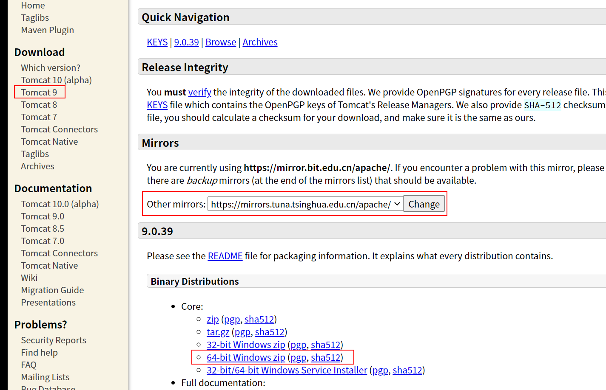
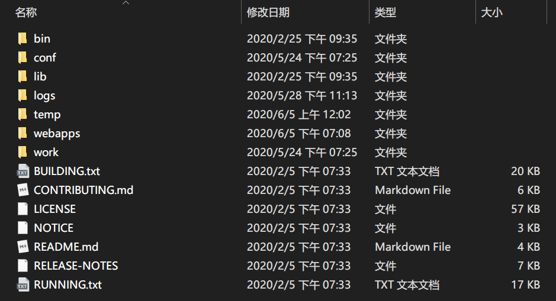

<!-- more -->

---

## Tomcat简介

Tomcat简单的说就是一个运行Java的网络服务器，底层是Socket的一个程序，它也是JSP和Serlvet的一个容器。

如果你学过html，css，你会知道你写的页面只能自己访问，别人不能远程访问你写的页面，Tomcat就是提供能够让别人访问自己写的页面的一个程序。

## 安装Tomcat

Tomcat[官网](http://tomcat.apache.org/)下载

选择下载的版本、合适的镜像以及对于系统的压缩包



解压压缩包，得到以下目录



```
Tomcat-9.0
 ├── bin               启动关闭的脚本文件
 ├── conf              配置文件
 ├── lib               依赖的Jar包
 ├── logs              日志
 ├── temp              临时文件
 ├── webapps           网站资源   
 ├── work              工作目录
 ├── BUILDING.txt
 ├── CONTRIBUTING.md
 ├── LICENSE
 ├── NOTICE
 ├── README.md
 ├── RELEASE-NOTES
 └── RUNNING.txt
```

## 启动和关闭Tomcat

打开bin文件夹的startup.bat文件，这时弹出黑窗口且不报错，表示启动成功，访问http://localhost:8080/可以看到Tomcat的欢迎页面。

关闭黑窗口或者点击bin文件夹下的shutdown.bat文件。

可能遇到的问题及其解决方法：

+ Java环境没有配置
+ 乱码问题，修改配置文件

## Tomcat的配置

在 *\conf\server.xml 修改对应配置即可，如端口号：

```xml
    <Connector port="8080" protocol="HTTP/1.1"
               connectionTimeout="20000"
               redirectPort="8443" />
```

修改主机的名称，需要配置hosts 127.0.0.1

```xml
      <Host name="localhost"  appBase="webapps"
            unpackWARs="true" autoDeploy="true">
```


