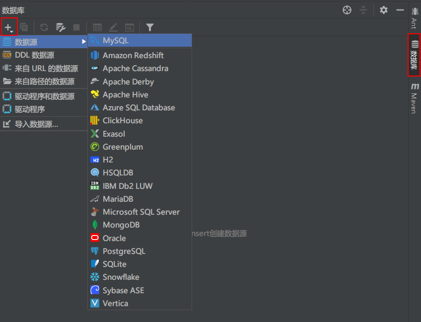
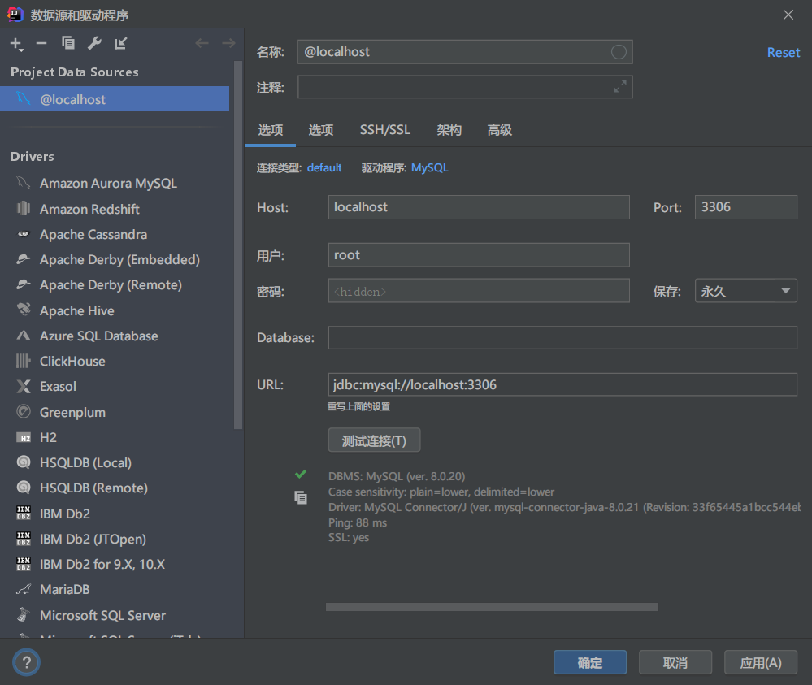



参考《Java EE互联网轻量级框架整合开发》、[MyBatis官方文档](https://mybatis.org/mybatis-3/zh/index.html)



<!-- more -->

---

## 什么是MyBatis


+ MyBatis 是一款优秀的**持久层**框架，它支持自定义 SQL、存储过程以及高级映射。

+ MyBatis 免除了几乎所有的 JDBC 代码以及设置参数和获取结果集的工作。

+ MyBatis 可以通过简单的 XML 或注解来配置和映射原始类型、接口和 Java POJO（Plain Old Java Objects，普通老式 Java 对象）为数据库中的记录。

> 持久化：将程序的数据在持久状态和瞬时状态转化的过程
>
> 持久层：完成持久化工作的代码

## MyBatis和Hibernate

MyBatis 的前身是 Apache 的开源项目iBatis，是一个基于 Java 的持久层框架。MyBatis 的优势在于灵活，它几乎可以代替 JDBC ，同时提供了接口编程。目前 MyBatis 的数据访问层 DAO (Data Access Objects）是不需要实现类的，它只需要一个接口和 XML（或者注解）。MyBatis 提供自动映射、动态 SQL、级联、缓存、注解、代码和 SQL 分离等特性，使用方便，同时也可以对 SQL 进行优化。因为其具有封装少、映射多样化、支持存储过程、可以进行 SQL 优化等特点，使得它取代了 Hibernate 成为了 Java 互联网中首选的持久框架。

Hibernate 作为一种十分流行的框架，它有其无可替代的优势，这里我们有必要讨论一下它和 MyBatis 的区别。由于 MyBatis 和 Hibernate 都是持久层框架，都会涉及数据库，所以首先定义一个数据库表一一角色表（t_role）

```
ID-->int(12)
roleName-->varchar(60)
note-->varchar(1024)
```

根据这个角色表，我们可以用一个 POJO (Plain Ordinary Java Object ）和这张表定义的字段对应起来

```java
package com.learn.chapterl.pojo;
public class Role implements java.io.Serializable{
    private Integer id;
    private String roleName;
    private String note;
    /** setter and getter **/
}
```

无论是 MyBatis 还是 Hibernate 都是依靠某种方法，将数据库的表和 POJO 映射起来的，这样程序员就可以操作 POJO 来完成相关的逻辑了。

### Hibernate 简介

要将POJO和数据库映射起来需要给这些框架提供映射规则 ，所以下一步要提供映射的规则。

在 MyBatis 或者 Hibernate 中可以通过 XML 或者注解提供映射规则， 这里讨论的是XML方式，因为在 MyBatis 中注解方式会受到一定的限制，所以 MyBatis 通常使用 XML方式实现映射关系。

我们把 POJO 对象和数据库表相互映射的框架称为对象关系映射（ Object Relational Mapping, ORM，或O/RM，或 O/R mapping ）框架。无论 MyBatis 或者 Hibernate 都可以称为 ORM 框架 ，只是 Hibernate 的设计理念是完全面向 POJO 的，而 MyBatis 则不是。Hibernate 基本不再需要编写 SQL 就可以通过映射关系来操作数据库，是一种全表映射的体现：而 MyBatis 则不同，它需要我们提供 SQL 去运行。

Hibernate 是将 POJO 和数据库表对应的映射文件

```xml
<hibernate-mapping> 
    <class name=”com.learn.chapterl.pojo.Role” table="t_role"> 
        <id name=”id” type=”java.lang.Integer”>
            <column name=”id”/>
            <generator class="identity" /> 
        </id> 
        <property name＝”roleName” type＝”string” >
            <column name="role_name" length="60" not-null="true"/>
        </property> 
        <property name="note" type="string">
            <column name="note" length="512"/>
        </property> 
    </class> 
</hibernate-mapping>
```

首先，对 POJO 和表 t_role 进行了映射配置，把两者映射起来了。然后，对 POJO 进行操作，从而影响t_role 表的数据，比如对其增、删、查、改

```java
//Hibernate 通过 Session 操作数据库数据
Session session = null;
Transaction tx = null;
try {
    //打开 Session
    session = HibernateUtil.getSessionFactory().openSession();
    //事务
    tx = session.beginTransaction();
    //POJO
    Role role = new Role();
    role.setId(1);
    rold.setRoleName("rolename1");
    role.setNote("note1");
    session.save(role);//保存
    Role role2 = (Role) session.get(Role.class, 1);//查询
    role2.setNote("修改备注");
    session.updata(role2);//更新
    System.err.println(role2.getRoleName());
    session.delete(role2);//删除
    tx.commit();//提交事务
} catch (Exception ex){
    if (tx != null && tx.isActive()){
        tx.rollback()//回滚事务
    }
    ex.printStackTrace();
} finally {
    if (session != null && session.isOpen()){
        session.close();
    }
}
```

这里我们没有看到 SQL ，那是因为 Hibernate 会根据映射关系来生成对应的 SQL，程序员不用精通 SQL，只要懂得操作 POJO 就能够操作对应数据库的表了。这在管理系统时代是十分有利的 。因为对于管理系统而言，首先在于实现业务逻辑，然后才是性能，所以 Hibernate 成为了那个时代的主流持久框架。

### MyBatis简介

在移动互联网时代，MyBatis 成为了目前互联网 Java 持久框架的首选，与 Hibernate 消除 SQL 不同，MyBatis 不屏蔽 SQL。不屏蔽 SQL 的优势在于，程序员可以自己制定 SQL规则，无须 Hibernate 自动生成规则，这样能够更加精确地定义 SQL ，从而优化性能 。它更符合移动互联网高并发、大数据、高性能 、 高响应的要求。

与 Hibernate 一样 ，MyBatis 也需要一个映射文件把 POJO 和数据库的表对应起来。

```xml
<mapper namespace="com.learn.chapterl.mapper.RoleMapper">
    <resultMap id="roleMap" type="com.learn.chapterl.pojo.Role">
        <id property="id" column="id"/>
        <result property="roleName" column="role_name"/>
        <result property="note" column="note"/>
    </resultMap> 
    
    <select id="getRole" resultMap="roleMap">
        select id, role_name, note from t_role where id = #{id}
    </select> 
    
    <delete id ="deleteRole" parameterType="int">
    	delete from t_role where id = #{id} 
    </delete> 
    
    <insert id ="insertRole" parameterType="com.learn.chapterl.pojo.Role">
    	insert into t_role(role_name, note) values(#{roleName}, #{note}) 
    </insert> 
    
    <update id="updateRole" parameterType="com.learn.chapterl.pojo.Role" >
        update t_role set 
        role name= #{roleName}, 
        note = #{note} 
        where id = #{id} 
    </update> 
</mapper>
```

这里的 `resultMap` 元素用于定义映射规则 ，而实际上 MyBatis 在满足一定的规则下，完成自动映射，而增、删、查、改对应着 insert 、delete 、select、update 四个元素，十分明了 。

> 注意，`mapper` 元素中的 `namespace` 属性，它要和一个接口的全限定名保持一致 ，而里面的 SQL 的 `id` 也需要和接口定义的方法完全保持一致

定义 MyBatis 映射文件

```java
package com.learn.chapterl.mapper;
import com.learn.chapterl.pojo.Role;
public interface RoleMapper{
    public Role getRole(Integer id);
    public int deletRole(Integer id);
    public int insertRole(Role role);
    public int updateRole(Role role);
}
```

对角色类的增、删、 查 、 改

```java
SqlSession sqlSession = null;
try { 
    sqlSession = MyBatisUtil.getSqlSession();
    RoleMapper roleMapper = sqlSession.getMapper(RoleMapper.class); 
    Role role = roleMapper.getRole(1);//查询
    System.err.println(role.getRoleName()); 
    role.setRoleName("update role name"); 
    roleMapper.updateRole(role);//更新
    Role role2 = new Role(); 
    role2.setNote("note2"); 
    role2.setRoleName("role2"); 
    roleMapper.insertRole(role); //插入
    roleMapper.deleteRole(S); //删除
    sqlSession.commit(); //提交事务
} catch (Exception ex) { 
	ex.printStackTrace();
    if (sqlSession != null) { 
    sqlSession.rollback();//回滚事务
    }
} finally{//关闭连接
    if (sqlSession ! = null) { 
    sqlSession.close();
    }
	}  
```

显然 MyBatis 在业务逻辑上和 Hibernate 是大同小异的。其区别在于，MyBatis 需要提供接口和 SQL ，这意味着它的工作量会 比 Hibernate 大，但是由于自定义 SQL 、 映射关系，所以其灵活性、可优化性就超过了 Hibernate 。互联网可优化性、灵活性是十分重要 的，因为一条 SQL 的性能可能相差十几倍到几十倍，这对于互联网系统是十分重要的 。

### Hibernate 和 MyBatis 的区别

Hibernate 和 MyBatis 的增、删、查、改，对于业务逻辑层来说大同小异，对于映射层而言 Hibernate 的配置不需要接口和 SQL ，相反 MyBatis 是需要的。

对于 Hibernate 而言 ，不需要编写大量的 SQL，就可以完全映射，同时提供了日志、缓存、级联（级联比 MyBatis 强大）等特性， 此外还提供 HQL (Hibernate Query Language ）对 POJO 进行操作，使用十分方便，但是它也有致命的缺陷。

由于无须 SQL ，当多表关联超过 3 个的时候，通过 Hibernate 的级联会造成太多性能的丢失 ，又或者我现在访问 一个财务的表，然后它会关联财产信息表，财产又分为机械、原料等，显然机械和原料的字段是不一样的，这样关联字段只能根据特定的条件变化而变化，而 Hibernate 无法支持这样的变化 。 遇到存储过程， Hibernate 只能作罢。更为关键的是性能，在管理系统的时代，对于性能的要求不是那么苛刻，但是在互联网时代性能就是系统的根本，响应过慢就会丧失客户，试想一下谁会去用一个经常需要等待超过10 秒以上的应用呢？

以上的问题 MyBatis 都可以解决，MyBatis 可以自由书写 SQL、支持动态 SQL、处理列表、动态生成表名、支持存储过程。这样就可 以灵活地定义查询语句 ，满足各类需求和性能优化的需要，这些在互联网系统中是十分重要 的。

但 MyBatis 也有缺陷 。

+ 首先，它要编写 SQL 和映射规则，其工作量稍微大于 Hibernate 。

+ 其次，它支持的工具也很有限，不能像 Hibernate 那样有许多的插件可以帮助生成映射代码和关联关系，而即使使用生成工具，往往也需要开发者进一步简化，MyBatis 通过手工编码，工作量相对大些。

所以对于性能要求不太苛刻 的系统，比如管理系统、ERP 等推荐使用 Hibernate；

而对于性能要求高、响应快、灵活的系统则推荐使用 MyBatis 。

## 获取MyBatis

### GitHub

GitHub[地址](https://github.com/mybatis/mybatis-3)

是一个Maven项目，点击Releases，选择版本即可下载

### Maven仓库

Maven仓库[地址](https://mvnrepository.com/artifact/org.mybatis/mybatis)

```xml
<!-- https://mvnrepository.com/artifact/org.mybatis/mybatis -->
<dependency>
    <groupId>org.mybatis</groupId>
    <artifactId>mybatis</artifactId>
    <version>3.5.5</version>
</dependency>
```

## HelloMyBatis

### 搭建环境

1、创建数据库

```mysql
CREATE DATABASE `mybatis`;
USE `mybatis`;

SET NAMES utf8mb4;
SET FOREIGN_KEY_CHECKS = 0;

-- ----------------------------
-- Table structure for user
-- ----------------------------
DROP TABLE IF EXISTS `user`;
CREATE TABLE `user`  (
  `id` int(0) NOT NULL AUTO_INCREMENT,
  `name` varchar(255) CHARACTER SET utf8 COLLATE utf8_general_ci NULL DEFAULT NULL,
  `pwd` varchar(255) CHARACTER SET utf8 COLLATE utf8_general_ci NULL DEFAULT NULL,
  PRIMARY KEY (`id`) USING BTREE
) ENGINE = InnoDB CHARACTER SET = utf8 COLLATE = utf8_general_ci ROW_FORMAT = Dynamic;

-- ----------------------------
-- Records of user
-- ----------------------------
INSERT INTO `user` VALUES (1, '张三', '123456');
INSERT INTO `user` VALUES (2, '李四', '123456');
INSERT INTO `user` VALUES (3, '王五', '123456');

SET FOREIGN_KEY_CHECKS = 1;
```

2、新建Maven项目

在IDEA中创建普通的Maven项目，并在pom.xml中导入以下三个依赖

```xml
<!--导入依赖-->
<dependencies>
    <!--mysql依赖-->
    <!-- https://mvnrepository.com/artifact/mysql/mysql-connector-java -->
    <dependency>
        <groupId>mysql</groupId>
        <artifactId>mysql-connector-java</artifactId>
        <version>8.0.21</version>
    </dependency>

    <!--mybatis-->
    <!-- https://mvnrepository.com/artifact/org.mybatis/mybatis -->
    <dependency>
        <groupId>org.mybatis</groupId>
        <artifactId>mybatis</artifactId>
        <version>3.5.5</version>
    </dependency>

    <!--junit-->
    <!-- https://mvnrepository.com/artifact/junit/junit -->
    <dependency>
        <groupId>junit</groupId>
        <artifactId>junit</artifactId>
        <version>4.12</version>
        <scope>test</scope>
    </dependency>
    
    <!-- lombok -->
    <dependency>
        <groupId>org.projectlombok</groupId>
        <artifactId>lombok</artifactId>
    </dependency>
</dependencies>
```

Maven解决配置文件无法导出的问题

```xml
<!--解决配置文件无法导出的问题-->
<build>
    <resources>
        <resource>
            <directory>src/main/resources</directory>
            <includes>
                <include>**/*.properties</include>
                <include>**/*.xml</include>
            </includes>
            <filtering>false</filtering>
        </resource>
        <resource>
            <directory>src/main/java</directory>
            <includes>
                <include>**/*.properties</include>
                <include>**/*.xml</include>
            </includes>
            <filtering>false</filtering>
        </resource>
    </resources>
</build>
```


### 创建模块

在父模块下创建 HelloMybatis 的 Maven 子模块

1、编写 Mybatis 的核心配置文件

在 HelloMybatis 模块中的 src->main->resources 中创建 mybatis-config.xml 配置文件，导入以下内容

```xml
<?xml version="1.0" encoding="UTF-8" ?>
<!DOCTYPE configuration
        PUBLIC "-//mybatis.org//DTD Config 3.0//EN"
        "http://mybatis.org/dtd/mybatis-3-config.dtd">
<!--核心配置文件-->
<configuration>
    <environments default="development">
        <environment id="development">
            <!--事物管理-->
            <transactionManager type="JDBC"/>
            <dataSource type="POOLED">
                <property name="driver" value="com.mysql.jdbc.Driver"/>
                <property name="url" value="jdbc:mysql://localhost:3306/mybatis?useSSL=false&amp;useUnicode=true&amp;characterEncoding=UTF-8"/>
                <property name="username" value="root"/>
                <property name="password" value="123456"/>
            </dataSource>
        </environment>
    </environments>
</configuration>
```

> 注意修改`property`中的不同`name`对应的`value`

其中 `url` 属性可按照以下步骤在IDEA中获取：选择数据库并连接



输入用户和密码进行连接，可以先测试连接，正常结果如下图所示



> 可能遇到IDEA连接MySQL时的时区问题具体解决方法可见该[博客](https://blog.csdn.net/qq_45181634/article/details/104260296?utm_medium=distribute.pc_aggpage_search_result.none-task-blog-2~all~first_rank_v2~rank_v28-15-104260296.nonecase&utm_term=idea%E8%AE%BE%E7%BD%AE%E6%97%B6%E5%8C%BA%E4%B8%BA&spm=1000.2123.3001.4430)

URL如上图显示为

```xml
jdbc:mysql://localhost:3306
```

但要进一步配置

```xml
jdbc:mysql://localhost:3306/mybatis?useSSL=false&amp;useUnicode=true&amp;characterEncoding=UTF-8

<!--jdbc:mysql://localhost:3306 标准端口号-->
<!--mybatis 对应数据库-->
<!--useSSL=false 不使用SSL-->
<!--useUnicode=true 使用Unicode编码-->
<!--characterEncoding=UTF-8 字符编码格式是UTF-8-->
```

2、编写MyBatis工具类

每个基于 MyBatis 的应用都是以一个 SqlSessionFactory 的实例为核心的。

SqlSessionFactory 的实例可以通过 SqlSessionFactoryBuilder 获得。而 SqlSessionFactoryBuilder 则可以从 XML 配置文件或一个预先配置的 Configuration 实例来构建出 SqlSessionFactory 实例。

既然有了 SqlSessionFactory，顾名思义，我们可以从中获得 SqlSession 的实例。SqlSession 提供了在数据库执行 SQL 命令所需的所有方法。可以通过 SqlSession 实例来直接执行已映射的 SQL 语句。

```java
// 官方文档
String resource = "org/mybatis/example/mybatis-config.xml";
InputStream inputStream = Resources.getResourceAsStream(resource);
SqlSessionFactory sqlSessionFactory = new SqlSessionFactoryBuilder().build(inputStream);
```

```java
package com.halo.utils;
public class MyBatisUtils {
    /**
     * 提升作用域
     */
    private static SqlSessionFactory sqlSessionFactory;

    static {
        // 获取sqlSessionFactory对象
        try {
            String resource = "mybatis-config.xml";
            InputStream inputStream = Resources.getResourceAsStream(resource);
            sqlSessionFactory = new SqlSessionFactoryBuilder().build(inputStream);
        }
        catch (IOException e) {
            e.printStackTrace();
        }
    }

    /**
     * 获取SqlSession实例,在此之前需要提升作用域
     */
    public static SqlSession getSqlSession() {
        return sqlSessionFactory.openSession();
    }
}
```


### 编写代码

1、创建pojo包并创建User.java

```java
package com.halo.pojo;

import lombok.Data;

@Data
public class User {
    private int id;
    private String name;
    private String pwd;
}

```

2、 在dao包中创建接口

```java
public interface UserDao {
    /**
     * 获取用户列表
     */
    List<User> getUserList();
}
```

3、从JDBC中的UserDaoImpl转变成UserMapper.xml文件

```xml
<?xml version="1.0" encoding="UTF-8" ?>
<!DOCTYPE mapper
        PUBLIC "-//mybatis.org//DTD Mapper 3.0//EN"
        "http://mybatis.org/dtd/mybatis-3-mapper.dtd">
<!--命名空间 绑定一个对应的Mapper接口-->
<mapper namespace="com.halo.dao.UserDao">
    <!--select 查询语句-->
    <!--id 对应方法名 resultType 返回类型-->
    <select id="getUserList" resultType="com.halo.pojo.User">
    select * from mybatis.user;
  </select>
</mapper>
```

### 测试

编写测试类

```java
public class UserDaoTest {
    @Test
    /**
     * 使用 getMapper
     */
    public void testUserDao() {
        // 获得 sqlSession 对象
        SqlSession sqlSession = MyBatisUtils.getSqlSession();
        // 执行 SQL  使用 getMapper 方法
        UserDao mapper = sqlSession.getMapper(UserDao.class);
        // 执行方法
        List<User> userList = mapper.getUserList();
        // 遍历并输出
        for (User user : userList) {
            System.out.println(user);
        }
        // 关闭 sqlSession
        sqlSession.close();
    }

    @Test
    /**
     * 使用 sqlSession.selectList，不建议使用
     */
    public void testUserDao2() {
        // 获得 sqlSession 对象
        SqlSession sqlSession = MyBatisUtils.getSqlSession();
        // 获取
        List<User> userList = sqlSession.selectList("com.halo.dao.UserDao.getUserList");
        // 遍历并输出
        for (User user : userList) {
            System.out.println(user);
        }
        // 关闭 sqlSession
        sqlSession.close();
    }
}
```

对应官网的两种方法

既然有了 SqlSessionFactory，顾名思义，我们可以从中获得 SqlSession 的实例。SqlSession 提供了在数据库执行 SQL 命令所需的所有方法。你可以通过 SqlSession 实例来直接执行已映射的 SQL 语句。例如：

```java
try (SqlSession session = sqlSessionFactory.openSession()) {
  Blog blog = (Blog) session.selectOne("org.mybatis.example.BlogMapper.selectBlog", 101);
}
```

诚然，这种方式能够正常工作，对使用旧版本 MyBatis 的用户来说也比较熟悉。但现在有了一种更简洁的方式——使用和指定语句的参数和返回值相匹配的接口（比如 BlogMapper.class），现在你的代码不仅更清晰，更加类型安全，还不用担心可能出错的字符串字面值以及强制类型转换。

例如：

```java
try (SqlSession session = sqlSessionFactory.openSession()) {
  BlogMapper mapper = session.getMapper(BlogMapper.class);
  Blog blog = mapper.selectBlog(101);
}
```

### 核心

#### SqlSessionFactoryBuilder

这个类可以被实例化、使用和丢弃，一旦**创建了 SqlSessionFactory，就不再需要它了**。 因此 SqlSessionFactoryBuilder 实例的最佳作用域是方法作用域（也就是局部方法变量）。 你可以重用 SqlSessionFactoryBuilder 来创建多个 SqlSessionFactory 实例，但最好还是不要一直保留着它，以保证所有的 XML 解析资源可以被释放给更重要的事情。

#### SqlSessionFactory

SqlSessionFactory 一旦被创建就应该在应用的运行期间一直存在，没有任何理由丢弃它或重新创建另一个实例。 使用 SqlSessionFactory 的最佳实践是在应用运行期间不要重复创建多次，多次重建 SqlSessionFactory 被视为一种代码“坏习惯”。因此 SqlSessionFactory 的最佳作用域是应用作用域。 有很多方法可以做到，最简单的就是使用单例模式或者静态单例模式。

#### SqlSession

每个线程都应该有它自己的 SqlSession 实例。SqlSession 的实例不是线程安全的，因此是不能被共享的，所以它的最佳的作用域是请求或方法作用域。 绝对不能将 SqlSession 实例的引用放在一个类的静态域，甚至一个类的实例变量也不行。 也绝不能将 SqlSession 实例的引用放在任何类型的托管作用域中，比如 Servlet 框架中吧的 HttpSession。 如果你现在正在使用一种 Web 框架，考虑将 SqlSession 放在一个和 HTTP 请求相似的作用域中。 换句话说，每次收到 HTTP 请求，就可以打开一个 SqlSession，**返回一个响应后，就关闭它**。 这个关闭操作很重要，为了确保每次都能执行关闭操作，你应该把这个关闭操作放到 finally 块中。 下面的示例就是一个确保 SqlSession 关闭的标准模式：

```java
try (SqlSession session = sqlSessionFactory.openSession()) {
  // 你的应用逻辑代码
}
```

在所有代码中都遵循这种使用模式，可以保证所有数据库资源都能被正确地关闭。

## 增删改查 CRUD

在 HelloMybatis 基本结构的基础上进行修改

### SELECT

Mapper代码

```java
public interface UserMapper {
    /**
     * 获取用户列表
     *
     * @return UserList
     */
    List<User> getUserList();

    /**
     * 根据ID查询用户
     *
     * @param id 用户ID
     * @return 对应ID用户
     */
    User getUserByID(int id);
}
```

对应Mapper.xml

```xml
    <!--select 查询语句-->
    <!--id 对应方法名 resultType 返回类型(全限定名)-->
    <select id="getUserList" resultType="com.halo.pojo.User">
        select *
        from mybatis.user;
    </select>

    <!--parameterType 参数类型-->
    <select id="getUserByID" parameterType="int" resultType="com.halo.pojo.User">
        select *
        from mybatis.user
        where id = #{id};
    </select>
```

对应测试类

```java
    @Test
    /**
     * 使用 getMapper
     */
    public void testUserMapper() {
        // 获得 sqlSession 对象
        SqlSession sqlSession = MyBatisUtils.getSqlSession();
        // 执行 SQL  使用 getMapper 方法
        UserMapper mapper = sqlSession.getMapper(UserMapper.class);
        // 执行方法
        List<User> userList = mapper.getUserList();
        // 遍历并输出
        for (User user : userList) {
            System.out.println(user);
        }
        // 关闭 sqlSession
        sqlSession.close();
    }

    @Test
    /**
     * 使用 sqlSession.selectList，不建议使用
     */
    public void testUserMapper2() {
        // 获得 sqlSession 对象
        SqlSession sqlSession = MyBatisUtils.getSqlSession();
        // 获取
        List<User> userList = sqlSession.selectList("com.halo.dao.UserMapper.getUserList");
        // 遍历并输出
        for (User user : userList) {
            System.out.println(user);
        }
        // 关闭 sqlSession
        sqlSession.close();
    }

    @Test
    /**
     * 测试getUserByID方法
     */
    public void testGetUserByID() {
        // 获得 sqlSession 对象
        SqlSession sqlSession = MyBatisUtils.getSqlSession();
        UserMapper mapper = sqlSession.getMapper(UserMapper.class);

        User user2 = mapper.getUserByID(2);
        System.out.println("user2 = " + user2);

        // 关闭 sqlSession
        sqlSession.close();
    }
```

### INSERT

Mapper代码

```java
public interface UserMapper {
	/**
     * 插入用户
     *
     * @param user User对象
     * @return null
     */
    int addUser(User user);
}
```

对应Mapper.xml

```xml
<!--insert 插入语句-->
<insert id="addUser" parameterType="com.halo.pojo.User">
    insert into mybatis.user(id, name, pwd)
    values (#{id}, #{name}, #{pwd});
</insert>
```

对应测试类

```java
@Test
/**
 * 测试addUser方法
 * 增删改需要提交调事务
 */
public void testAddUser() {
    // 获得 sqlSession 对象
    SqlSession sqlSession = MyBatisUtils.getSqlSession();
    UserMapper mapper = sqlSession.getMapper(UserMapper.class);

    int halo = mapper.addUser(new User(4, "halo", "123456"));
    if (halo > 0) {
        System.out.println("插入成功");
    }

    // 提交事务
    sqlSession.commit();

    // 关闭 sqlSession
    sqlSession.close();
}
```

### UPDATE

Mapper代码

```java
public interface UserMapper {
    /**
     * 修改用户
     *
     * @param user 用户对象
     * @return null
     */
    int updateUser(User user);
}
```

Mapper.xml代码

```xml
<!--update 修改-->
<update id="updateUser" parameterType="com.halo.pojo.User">
    update mybatis.user
    set name = #{name},
        pwd=#{pwd}
    where id = #{id};
</update>
```

对应测试类

```java
@Test
/**
 * 测试updateUser方法
 * 增删改需要提交调事务
 */
public void testUpdateUser() {
    // 获得 sqlSession 对象
    SqlSession sqlSession = MyBatisUtils.getSqlSession();
    UserMapper mapper = sqlSession.getMapper(UserMapper.class);

    mapper.updateUser(new User(4, "whl", "789789"));

    // 提交事务
    sqlSession.commit();

    // 关闭 sqlSession
    sqlSession.close();
}
```

### DELETE

Mapper代码

```java
public interface UserMapper {
    /**
     * 删除用户
     *
     * @param id 需要删除用户的ID
     * @return null
     */
    int deleteUser(int id);
}
```

对应Mapper.xml

```xml
<!--delete 删除-->
<delete id="deleteUser" parameterType="int">
    delete
    from mybatis.user
    where id = #{id};
</delete>
```

对应测试类

```java
@Test
/**
 * 测试deleteUser方法
 * 增删改需要提交调事务
 */
public void testDeleteUser() {
    // 获得 sqlSession 对象
    SqlSession sqlSession = MyBatisUtils.getSqlSession();
    UserMapper mapper = sqlSession.getMapper(UserMapper.class);

    mapper.deleteUser(4);

    // 提交事务
    sqlSession.commit();

    // 关闭 sqlSession
    sqlSession.close();
}
```


