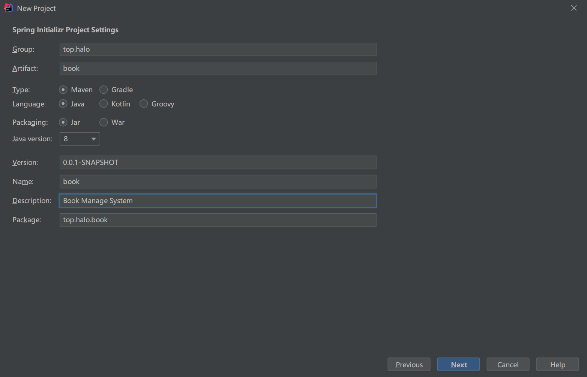
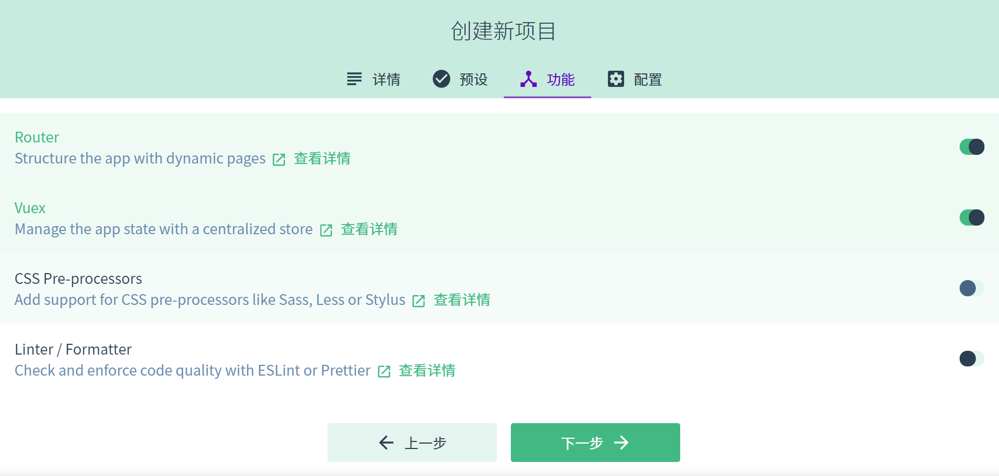

> 参考[视频](https://www.bilibili.com/video/BV137411B7vB)

## 创建项目

### 后端SpringBoot项目

使用IEDA提供的模板创建，新建一个Spring项目



导入需要的依赖，包括

+ Lombok
+ Spring Web
+ Spring Data JPA
+ MySQL Driver


完成项目创建


### 数据库连接

#### 创建数据库和数据表

创建名为Halo的数据库，使用以下建表SQL语句，创建book表和添加id、name、author、detail字段并加入有关数据。

```sql
SET NAMES utf8mb4;
SET FOREIGN_KEY_CHECKS = 0;

-- ----------------------------
-- Table structure for book
-- ----------------------------
DROP TABLE IF EXISTS `book`;
CREATE TABLE `book`  (
  `id` int(0) NOT NULL AUTO_INCREMENT,
  `name` varchar(255) CHARACTER SET utf8 COLLATE utf8_general_ci NULL DEFAULT NULL,
  `author` varchar(255) CHARACTER SET utf8 COLLATE utf8_general_ci NULL DEFAULT NULL,
  `detail` varchar(255) CHARACTER SET utf8 COLLATE utf8_general_ci NULL DEFAULT NULL,
  PRIMARY KEY (`id`) USING BTREE
) ENGINE = InnoDB CHARACTER SET = utf8 COLLATE = utf8_general_ci ROW_FORMAT = Dynamic;

-- ----------------------------
-- Records of book
-- ----------------------------
INSERT INTO `book` VALUES (1, 'Java', 'A', 'Java从入门到入土');
INSERT INTO `book` VALUES (2, 'Python', 'B', 'Python从入门到入土');
INSERT INTO `book` VALUES (3, 'Go', 'C', 'Go从入门到入土');
INSERT INTO `book` VALUES (4, 'C', 'D', 'C从入门到入土');
INSERT INTO `book` VALUES (5, 'C++', 'E', 'C++从入门到入土');
INSERT INTO `book` VALUES (8, 'Kotlin', 'G', 'Kotlin从入门到入土');
INSERT INTO `book` VALUES (9, 'SpringBoot', 'H', 'SpringBoot从入门到入土');
INSERT INTO `book` VALUES (10, 'Vue', 'I', 'Vue从入门到入土');
INSERT INTO `book` VALUES (11, 'Node.js', 'J', 'Node.js从入门到入土');
INSERT INTO `book` VALUES (12, 'Linux', 'K', 'Linux入门到入土');

SET FOREIGN_KEY_CHECKS = 1;
```

#### 后端SpringBoot配置

打开src目录下resources目录中的application.properties文件，将其转换成yaml格式，添加以下连接配置

```yaml
# Spring配置
spring:
  datasource:
    url: jdbc:mysql://localhost:3306/halo?useUnicode=true&characterEncoding=utf8&zeroDateTimeBehavior=convertToNull&useSSL=true&serverTimezone=GMT%2B8
    username: root
    password: 123456
    driver-class-name: com.mysql.cj.jdbc.Driver
  jpa:
    # 打印 sql
    show-sql: true
    properties:
      hibernate:
        # 格式化 sql
        format_sql: true
server:
  port: 8181
```

### 前端Vue项目

有关环境 @vue/cli 4.5.10

#### 创建Vue项目

打开命令行工具吗，输入

```
vue ui
```

进入http://localhost:8000/，进行可视化创建Vue项目

选择项目创建位置




这里选择添加Router和Vuex，关闭Linter/Formatter


这里使用Vue2，等待一段时间即可完成项目创建，在ui目录下键入

```
npm run serve
```

即可启动项目

#### 添加有关依赖和插件

① Element插件

在添加插件中搜索element，选择对应的插件安装即可


② 添加axios

在ui目录下输入`vue add axios`

```
E:\Project\Halo\halo-bookmanageui>vue add axios
```

即可安装axios插件

## 配置后端

在BookApplication同级目录下创建controller、entity和repository包

entity包中创建Book实体类，代码如下

```java
package top.halo.book.entity;

import lombok.Data;

import javax.persistence.Entity;
import javax.persistence.GeneratedValue;
import javax.persistence.GenerationType;
import javax.persistence.Id;

/**
 * @author Halo
 * @date Created in 2021/01/18  13:49
 * @description
 */
@Entity
@Data // Lombok 写入Gettr、Setter方法
public class Book {
    @Id  // 对应数据库中主键
    @GeneratedValue(strategy = GenerationType.IDENTITY) // 设置主键自增
    private Integer id;
    private String name;
    private String author;
    private String detail;
}

```

在repository包中创建BookRepository接口，代码如下

```java
package top.halo.book.repository;

import org.springframework.data.jpa.repository.JpaRepository;
import top.halo.book.entity.Book;

/**
 * @author Halo
 * @date Created in 2021/01/18  13:54
 * @description
 */
public interface BookRepository extends JpaRepository<Book,Integer> {
}
```

以上代码继承了Spring Data JPA中的一些方法，用于之后的增删改查

在controller中创建BookHandler，代码如下

```java
package top.halo.book.controller;

import org.springframework.beans.factory.annotation.Autowired;
import org.springframework.data.domain.Page;
import org.springframework.data.domain.PageRequest;
import org.springframework.data.domain.Pageable;
import org.springframework.web.bind.annotation.*;
import top.halo.book.entity.Book;
import top.halo.book.repository.BookRepository;

import java.util.List;

/**
 * @author Halo
 * @date Created in 2021/01/18  13:56
 * @description
 */
@CrossOrigin // 用于跨域访问
@RestController
@RequestMapping("/book")
public class BookHandler {
    @Autowired
    private BookRepository bookRepository;

    @GetMapping("/findAll")
    public List<Book> finaAll() {
        return bookRepository.findAll();
    }

    @GetMapping("/findPage/{page}/{size}")
    public Page<Book> findAll(@PathVariable("page") Integer page, @PathVariable("size") Integer size) {
        Pageable pageable = PageRequest.of(page - 1, size);
        return bookRepository.findAll(pageable);
    }

    @PostMapping("/save")
    public String save(@RequestBody Book book) {
        Book result = bookRepository.save(book);
        if (result != null) {
            return "success";
        }
        else {
            return "error";
        }
    }

    @GetMapping("/findById/{id}")
    public Book findById(@PathVariable("id") Integer id) {
        return bookRepository.findById(id).get();
    }

    @PutMapping("/update")
    public String update(@RequestBody Book book) {
        Book result = bookRepository.save(book);
        if (result != null) {
            return "success";
        }
        else {
            return "error";
        }
    }

    @DeleteMapping("deleteById/{id}")
    public void deleteById(@PathVariable("id") Integer id) {
        bookRepository.deleteById(id);
    }
}

```

## 配置前端

### 添加页面

① BookIndex

在views中创建BookIndex.vue

```vue
<template>
  <div>
    <el-container style="height: 500px; border: 1px solid #eee">
      <el-aside width="200px" style="background-color: rgb(238, 241, 246)">
        <el-menu router :default-openeds="['0']">
          <el-submenu v-for="(item,index) in $router.options.routes" :index="index+''" v-if="item.show">
            <template slot="title"><i class="el-icon-message"></i>{{ index }}-{{ item.name }}</template>
            <el-menu-item v-for="(item2,index2) in item.children" :index="item2.path"
                          :class="$route.path==item2.path?'is-active':''">
              {{ item2.name }}
            </el-menu-item>
          </el-submenu>
        </el-menu>

      </el-aside>

      <el-container>
        <el-header style="text-align: right; font-size: 12px">
          <span>Halo</span>
        </el-header>

        <el-main>
          <router-view></router-view>
        </el-main>
      </el-container>
    </el-container>

  </div>
</template>

<script>
export default {
  name: "Index",
}
</script>

<style scoped>
.el-header {
  background-color: #B3C0D1;
  color: #333;
  line-height: 60px;
}

.el-aside {
  color: #333;
}
</style>

```

② BookManage

在views中创建BookManage.vue

```vue
<template>
  <div>
    <el-table
        :data="tableData"
        border
        style="width: 100%">
      <el-table-column
          fixed
          prop="id"
          label="编号"
          width="100">
      </el-table-column>
      <el-table-column
          prop="name"
          label="书名"
          width="150">
      </el-table-column>
      <el-table-column
          prop="detail"
          label="描述"
          width="200">
      </el-table-column>
      <el-table-column
          label="操作"
          width="150">
        <template slot-scope="scope">
          <el-button @click="edit(scope.row)" type="text" size="small">修改</el-button>
          <el-button @click="deleteById(scope.row)" type="text" size="small">删除</el-button>
        </template>
      </el-table-column>
    </el-table>
    <el-pagination
        background
        layout="prev, pager, next"
        page-size="6"
        :total="total"
        @current-change="page">
    </el-pagination>
  </div>
</template>

<script>
export default {
  methods: {

    edit(row) {
      this.$router.push({
        path: '/page3',
        query: {
          id: row.id
        }
      })
    },
    deleteById(row) {
      const _this = this;
      axios.delete("http://localhost:8181/book/deleteById/" + row.id).then(function (resp) {
        _this.$alert(row.name + '删除成功', '消息', {
          confirmButtonText: '确定',
          callback: action => {
            window.location.reload()
          }
        });
      })
    },
    page(currentPage) {
      const _this = this;
      axios.get("http://localhost:8181/book/findPage/" + currentPage + "/6").then(function (resp) {
        _this.tableData = resp.data.content
        _this.total = resp.data.totalElements
      })
    }
  },
  created() {
    const _this = this;
    axios.get("http://localhost:8181/book/findPage/1/6").then(function (resp) {
      _this.tableData = resp.data.content
      _this.total = resp.data.totalElements
    })
  },
  data() {
    return {
      total: null,
      tableData: null
    }
  }
}
</script>

```

③ BookAdd

在views中创建BookAdd.vue

```vue
<template>
  <div>
    <el-form :model="ruleForm" :rules="rules" ref="ruleForm" label-width="100px" class="demo-ruleForm">
      <el-form-item label="书名" prop="name">
        <el-input v-model="ruleForm.name"></el-input>
      </el-form-item>
      <el-form-item label="作者" prop="author">
        <el-input v-model="ruleForm.author"></el-input>
      </el-form-item>
      <el-form-item label="描述" prop="detail">
        <el-input v-model="ruleForm.detail"></el-input>
      </el-form-item>
      <el-form-item>
        <el-button type="primary" @click="submitForm('ruleForm')">提交</el-button>
        <el-button @click="resetForm('ruleForm')">重置</el-button>
        <el-button @click="test()">test</el-button>
      </el-form-item>
    </el-form>
  </div>
</template>

<script>
export default {
  data() {
    return {
      ruleForm: {
        name: '',
        author: '',
        detail: '',
      },
      rules: {
        name: [
          {required: true, message: '请输入活动名称', trigger: 'blur'},
        ],
        author: [
          {required: true, message: '请输入作者名称', trigger: 'blur'},
        ],
        detail: [
          {required: false, message: '请输入书籍描述', trigger: 'blur'},
          {min: 1, max: 15, message: '长度在 1 到 15 个字符', trigger: 'blur'}
        ]
      }
    };
  },
  methods: {
    test() {
      console.log(this.ruleForm);
    },
    submitForm(formName) {
      const _this = this;
      this.$refs[formName].validate((valid) => {
        if (valid) {
          axios.post("http://localhost:8181/book/save", this.ruleForm).then(function (resp) {
            if (resp.data == "success") {
                _this.$message({
                  message: '添加成功',
                  type: 'success'
                });
                _this.$router.push("/BookManage")
            }
          });
        } else {
          console.log('error submit!!');
          return false;
        }
      });
    },
    resetForm(formName) {
      this.$refs[formName].resetFields();
    }
  }
}
</script>

<style scoped>

</style>

```

③ BookUpdate

在views中创建BookUpdate.vue

```vue
<template>
  <div>
    <el-form :model="ruleForm" :rules="rules" ref="ruleForm" label-width="100px" class="demo-ruleForm">
      <el-form-item label="书名" prop="name">
        <el-input v-model="ruleForm.name"></el-input>
      </el-form-item>
      <el-form-item label="作者" prop="author">
        <el-input v-model="ruleForm.author"></el-input>
      </el-form-item>
      <el-form-item label="描述" prop="detail">
        <el-input v-model="ruleForm.detail"></el-input>
      </el-form-item>
      <el-form-item>
        <el-button type="primary" @click="submitForm('ruleForm')">修改</el-button>
        <el-button @click="resetForm('ruleForm')">重置</el-button>
        <el-button @click="test()">test</el-button>
      </el-form-item>
    </el-form>
  </div>
</template>


<script>
export default {

  data() {
    return {
      ruleForm: {
        name: '',
        author: '',
        detail: '',
      },
      rules: {
        name: [
          {required: true, message: '请输入活动名称', trigger: 'blur'},
        ],
        author: [
          {required: true, message: '请输入作者名称', trigger: 'blur'},
        ],
        detail: [
          {required: false, message: '请输入书籍描述', trigger: 'blur'},
          {min: 1, max: 15, message: '长度在 1 到 15 个字符', trigger: 'blur'}
        ]
      }
    };
  },
  methods: {
    test() {
      console.log(this.ruleForm);
    },
    submitForm(formName) {
      const _this = this;
      this.$refs[formName].validate((valid) => {
        if (valid) {
          axios.put("http://localhost:8181/book/update", this.ruleForm).then(function (resp) {
            if (resp.data == "success") {
              _this.$message({
                message: '修改成功',
                type: 'success'
              });
              _this.$router.push("/BookManage")
            }
          });
        } else {
          console.log('error submit!!');
          return false;
        }
      });
    },
    resetForm(formName) {
      this.$refs[formName].resetFields();
    }
  },
  created() {
    console.log(this.$route.query.id);
    const _this = this;
    axios.get("http://localhost:8181/book/findById/" + this.$route.query.id).then(function (resp) {
      _this.ruleForm = resp.data;
    })
  }
}
</script>


<style scoped>

</style>

```

### 配置路由

设置router

```javascript
import Vue from 'vue'
import VueRouter from 'vue-router'

Vue.use(VueRouter)

const routes = [
    {
        path: "/",
        name: "图书管理",
        show: true,
        component: () => import("../views/BookIndex"),
        redirect: "/BookManage",
        children: [
            {
                path: "/BookManage",
                name: "查询图书",
                component: () => import("../views/BookManage")
            },
            {
                path: "/BookAdd",
                name: "添加图书",
                component: () => import("../views/BookAdd")
            }
        ]
    },
    {
        path: "/",
        name: "导航2",
        component: () => import("../views/BookIndex"),
        children: [
            {
                path: "/page3",
                show: false,
                name: "页面3",
                component: () => import("../views/BookUpdate")
            }
        ]
    }

]

const router = new VueRouter({
    mode: 'history',
    base: process.env.BASE_URL,
    routes
})

export default router

```

