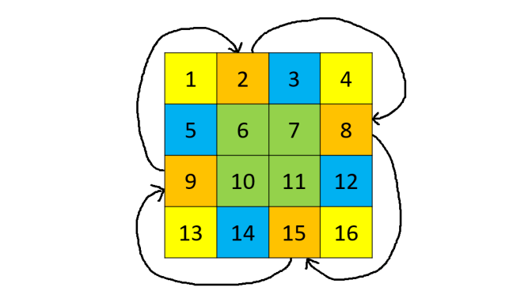

# 妙用数据结构

## C++ STL

### Sequence Containers

维持顺序的容器

1. vector：<font color="#faa755">动态数组</font>，是我们最常使用的数据结构之一，用于 O(1) 的随机读取。因为大部分算法的时间复杂度都会大于 O(n)，因此我们经常新建 vector 来存储各种数据或中间变量。因为在尾部增删的复杂度是 O(1)，我们也可以把它当作 stack 来用。
2. list：<font color="#faa755">双向链表</font>，也可以当作 stack 和 queue 来使用。由于 LeetCode 的题目多用 Node 来表示链表，且链表不支持快速随机读取，因此我们很少用到这个数据结构。一个例外是经典的 LRU 问题，我们需要利用链表的特性来解决，我们在后文会遇到这个问题。
3. deque：<font color="#faa755">双端队列</font>，这是一个非常强大的数据结构，既支持 O(1) 随机读取，又支持 O(1)时间的头部增删和尾部增删，不过有一定的额外开销。
4. array：固定大小的数组，一般在刷题时我们不使用。
5. forward_list：单向链表，一般在刷题时我们不使用。

### Container Adaptors

基于其它容器实现的数据结构

1. stack：<font color="#faa755">后入先出（LIFO）的数据结构</font>，默认基于 deque 实现。stack 常用于深度优先搜索、一些字符串匹配问题以及单调栈问题。
2. queue：<font color="#faa755">先入先出（FIFO）的数据结构</font>，默认基于 deque 实现。queue 常用于广度优先搜索。
3. priority_queue：<font color="#faa755">最大值先出的数据结构</font>，默认基于vector实现堆结构。它可以在$O(n \log n)$的时间排序数组，$O(\log n)$ 的时间插入任意值，$O(1)$ 的时间获得最大值，$O(\log n)$ 的时间删除最大值。priority_queue 常用于维护数据结构并快速获取最大或最小值。

### Associative Containers

实现了排好序的数据结构

1. set：<font color="#faa755">有序集合</font>，元素不可重复，底层实现默认为红黑树，即一种特殊的二叉查找树（BST）。它可以在 $O(n \log n)$ 的时间排序数组，$O(\log n)$ 的时间插入、删除、查找任意值，$O(\log n)$ 的时间获得最小或最大值。这里注意，set 和 priority_queue 都可以用于维护数据结构并快速获取最大最小值，但是它们的时间复杂度和功能略有区别，如priority_queue 默认不支持删除任意值，而 set 获得最大或最小值的时间复杂度略高，具体使用哪个根据需求而定。
2. multiset：支持重复元素的 set。
3. map：<font color="#faa755">有序映射或有序表</font>，在 set 的基础上加上映射关系，可以对每个元素 key 存一个值 value。
4. multimap：支持重复元素的 map。

### Unordered Associative Containers

对每个 Associative Containers 实现了哈希版本

1. unordered_set：哈希集合，可以在 $O(1)$ 的时间快速插入、查找、删除元素，常用于快速的查询一个元素是否在这个容器内。
2. unordered_multiset：支持重复元素的 unordered_set。
3. unordered_map：<font color="#faa755">哈希映射或哈希表</font>，在 unordered_set 的基础上加上映射关系，可以对每一个元素 key 存一个值 value。在某些情况下，如果 key 的范围已知且较小，我们也可以用 vector 代替 unordered_map，用位置表示 key，用每个位置的值表示 value。
4. unordered_multimap：支持重复元素的 unordered_map。

## 数组

### 448.[找到所有数组中消失的数字](https://leetcode-cn.com/problems/find-all-numbers-disappeared-in-an-array/)

#### <font color="#33a3dc">题目描述</font>

给定一个长度为 n 的数组，其中包含范围为 1 到 n 的整数，有些整数重复了多次，有些整数没有出现，求 1 到 n 中没有出现过的整数。

#### <font color="#33a3dc">输入输出样例</font>

输入是一个一维整数数组，输出也是一个一维整数数组，表示输入数组内没出现过的数字。

```
输入:[4,3,2,7,8,2,3,1]
输出:[5,6]
```

#### <font color="#33a3dc">题解</font>

利用数组这种数据结构建立 n 个桶，把所有重复出现的位置进行标记，然后再遍历一遍数组，即可找到没有出现过的数字。进一步地，我们可以直接对原数组进行标记：把重复出现的数字在原数组出现的位置设为负数，最后仍然为正数的位置即为没有出现过的数。

```c++
#include <vector>
#include <iostream>

using namespace std;

class Solution {
public:
    static vector<int> findDisappearedNumbers(vector<int> &nums) {

        // 创建桶
        vector<int> bucket(nums.size() + 1, 0);
        for (int num : nums) {
            bucket[num] = 1;
        }
        // 从桶中获取值
        vector<int> result;
        for (int i = 1; i < bucket.size(); ++i) {
            if (bucket[i] == 0) {
                result.push_back(i);
            }
        }
        return result;
    }
};

int main() {
    vector<int> test = {4, 3, 2, 7, 8, 2, 3, 1};
    vector<int> test2 = {1, 1};
    vector<int> result = Solution::findDisappearedNumbers(test2);
    for (int i = 0; i < result.size(); ++i) {
        cout << result[i] << " ";
    }
    return 0;
}
```

不创建新的桶，通过对原数组对应值变成负数进行标记

```c++
#include <vector>
#include <iostream>
#include <cstdlib>

using namespace std;

class Solution {
public:
    static vector<int> findDisappearedNumbers(vector<int> &nums) {

        vector<int> result;
        int pos;
        for (const int &num:nums) {
            // 获取坐标
            pos = abs(num) - 1;
            // 使对应坐标的值变成负值，用于标记
            if (nums[pos] > 0) {
                nums[pos] = -nums[pos];
            }
        }
        for (int i = 0; i < nums.size(); ++i) {
            if (nums[i] > 0) {
                result.push_back(i + 1);
            }
        }
        return result;
    }
};

int main() {
    vector<int> test = {4, 3, 2, 7, 8, 2, 3, 1};
    vector<int> test2 = {1, 1};
    vector<int> result = Solution::findDisappearedNumbers(test2);
    for (int i = 0; i < result.size(); ++i) {
        cout << result[i] << " ";
    }
    return 0;
}
```

 **<font color="#33a3dc">复杂度分析</font>**

时间复杂度：$O(n)$。$n$为数组长度

空间复杂度：$O(1)$。返回值不计入空间复杂度。

### 48. [旋转图像](https://leetcode-cn.com/problems/rotate-image/)

#### <font color="#33a3dc">题目描述</font>

给定一个 n × n 的矩阵，求它顺时针旋转 90 度的结果，且必须在原矩阵上修改（in-place）。怎样能够尽量不创建额外储存空间呢？

#### <font color="#33a3dc">输入输出样例</font>

输入和输出都是一个二维整数矩阵。


```
输入：matrix = [[1,2,3],[4,5,6],[7,8,9]]
输出：[[7,4,1],[8,5,2],[9,6,3]]
```


```
输入：matrix = [[5,1,9,11],[2,4,8,10],[13,3,6,7],[15,14,12,16]]
输出：[[15,13,2,5],[14,3,4,1],[12,6,8,9],[16,7,10,11]]
```

#### <font color="#33a3dc">题解</font>

每次只考虑四个间隔 90 度的位置，可以进行 $O(1)$ 额外空间的旋转。



相同颜色代表四个互相交换的位置

```c++
#include <vector>
#include <iostream>

using namespace std;

class Solution {
public:
    static void rotate(vector<vector<int>> &matrix) {
        int temp = 0, n = matrix.size() - 1;
        for (int i = 0; i <= n / 2; ++i) {
            for (int j = i; j < n - i; ++j) {
                temp = matrix[j][n - i];
                matrix[j][n - i] = matrix[i][j];
                matrix[i][j] = matrix[n - j][i];
                matrix[n - j][i] = matrix[n - i][n - j];
                matrix[n - i][n - j] = temp;
            }
        }
    }
};

int main() {
    vector<vector<int>> test = {{1,  2,  3,  4},
                                {5,  6,  7,  8},
                                {9,  10, 11, 12},
                                {13, 14, 15, 16}};
    Solution::rotate(test);
    for (auto &elements : test) {
        for (int element : elements) {
            cout << element << " ";
        }
        cout << endl;
    }
}
```

 **<font color="#33a3dc">复杂度分析</font>**

时间复杂度：$O(N^2)$，其中 $N$ 是矩阵的边长。我们需要枚举的子矩阵大小为 $O(\lfloor n/2 \rfloor \times \lfloor (n+1)/2 \rfloor) = O(N^2)$。

空间复杂度：$O(1)$。为原地旋转。

### 240.[搜索二维矩阵 II](https://leetcode-cn.com/problems/search-a-2d-matrix-ii/)

#### <font color="#33a3dc">题目描述</font>

给定一个二维矩阵，已知每行和每列都是增序的，尝试设计一个快速搜索一个数字是否在矩阵中存在的算法。

#### <font color="#33a3dc">输入输出样例</font>

输入是一个二维整数矩阵，和一个待搜索整数。

输出是一个布尔值，表示这个整数是否存在于矩阵中。


```
输入：matrix = [[1,4,7,11,15],[2,5,8,12,19],[3,6,9,16,22],[10,13,14,17,24],[18,21,23,26,30]], target = 5
输出：true
```

#### <font color="#33a3dc">题解</font>

我们可以从右上角开始查找，若当前值大于待搜索值，我们向左移动一位；若当前值小于待搜索值，我们向下移动一位。如果最终移动到左下角时仍不等于待搜索值，则说明待搜索值不存在于矩阵中。

```c++
#include <vector>
#include <iostream>

using namespace std;

class Solution {
public:
    static bool searchMatrix(vector<vector<int>> &matrix, int target) {
        int m = matrix.size();
        if (m == 0) {
            return false;
        }
        int n = matrix[0].size();
        int i = 0;
        int j = n - 1;
        while (i < m && j >= 0) {
            if (matrix[i][j] == target) {
                return true;
            } else if (matrix[i][j] > target) {
                j--;
            } else {
                i++;
            }
        }
        return false;
    }
};

int main() {
    vector<vector<int>> test = {{1,  4,  7,  11, 15},
                                {2,  5,  8,  12, 19},
                                {3,  6,  9,  16, 22},
                                {10, 13, 14, 17, 24},
                                {18, 21, 23, 26, 30}};
    vector<vector<int>> test2 = {{-5}};
    bool result = Solution::searchMatrix(test2, -5);
    cout << result << endl;

}
```

 **<font color="#33a3dc">复杂度分析</font>**

---

#### <font color="#33a3dc">题目描述</font>


#### <font color="#33a3dc">输入输出样例</font>


#### <font color="#33a3dc">题解</font>


 **<font color="#33a3dc">复杂度分析</font>**