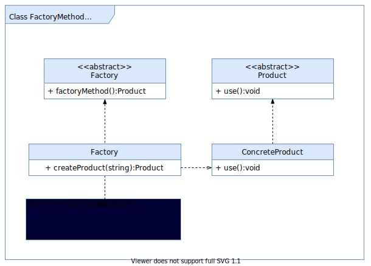
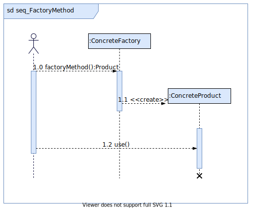

# 工厂方法模式

## 模式动机

现在对该系统进行修改，不再设计一个按钮工厂类来统一负责所有产品的创建，而是将具体按钮的创建过程交给专门的工厂子类去完成，我们先定义一个抽象的按钮工厂类，再定义具体的工厂类来生成圆形按钮、矩形按钮、菱形按钮等，它们实现在抽象按钮工厂类中定义的方法。这种抽象化的结果使这种结构可以在不修改具体工厂类的情况下引进新的产品，如果出现新的按钮类型，只需要为这种新类型的按钮创建一个具体的工厂类就可以获得该新按钮的实例，这一特点无疑使得工厂方法模式具有超越简单工厂模式的优越性，更加符合“开闭原则”。

## 模式定义

工厂方法模式(Factory Method Pattern)又称为工厂模式，也叫虚拟构造器(Virtual Constructor)模式或者多态工厂(Polymorphic Factory)模式，它属于类创建型模式。在工厂方法模式中，工厂父类负责定义创建产品对象的公共接口，而工厂子类则负责生成具体的产品对象，这样做的目的是将产品类的实例化操作延迟到工厂子类中完成，即通过工厂子类来确定究竟应该实例化哪一个具体产品类。

## 模式结构

工厂方法模式包含如下角色：

- Product：抽象产品
- Concrete Product：具体产品
- Factory：抽象工厂
- Concrete Factory：具体工厂



## 时序图



## 代码分析

```c++
#include "ConcreteFactory.h"
#include "ConcreteProduct.h"

Product* ConcreteFactory::factoryMethod(){

	return  new ConcreteProduct();
}
```

```c++
#include "Factory.h"
#include "ConcreteFactory.h"
#include "Product.h"
#include <iostream>
using namespace std;

int main(int argc, char *argv[])
{
	Factory * fc = new ConcreteFactory();
	Product * prod = fc->factoryMethod();
	prod->use();
	
	delete fc;
	delete prod;
	
	return 0;
}
```

## 模式分析

工厂方法模式是简单工厂模式的进一步抽象和推广。由于使用了面向对象的多态性，工厂方法模式保持了简单工厂模式的优点，而且克服了它的缺点。在工厂方法模式中，核心的工厂类不再负责所有产品的创建，而是将具体创建工作交给子类去做。这个核心类仅仅负责给出具体工厂必须实现的接口，而不负责哪一个产品类被实例化这种细节，这使得工厂方法模式可以允许系统在不修改工厂角色的情况下引进新产品。

## 实例

日志记录器

某系统日志记录器要求支持多种日志记录方式，如文件记录、数据库记录等，且用户可以根据要求动态选择日志记录方式， 现使用工厂方法模式设计该系统。

