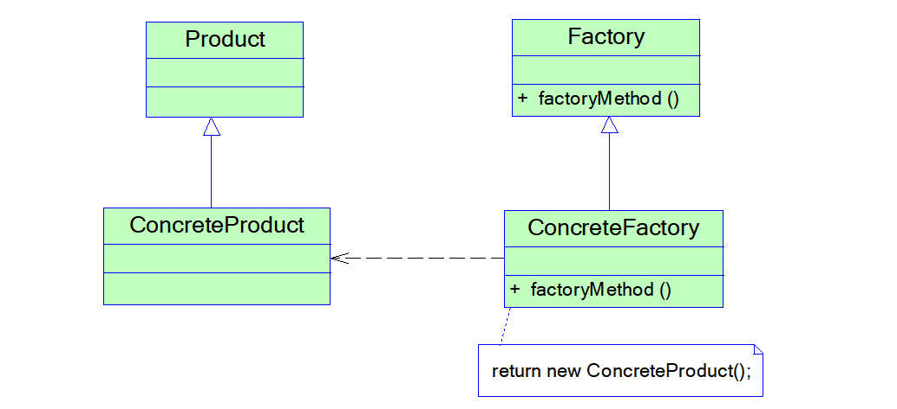
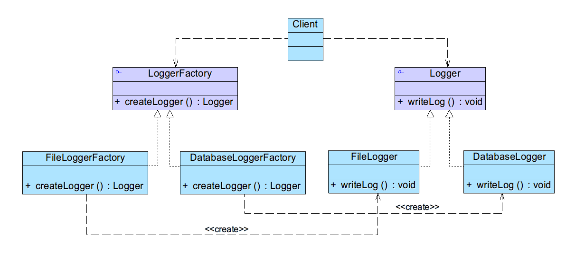
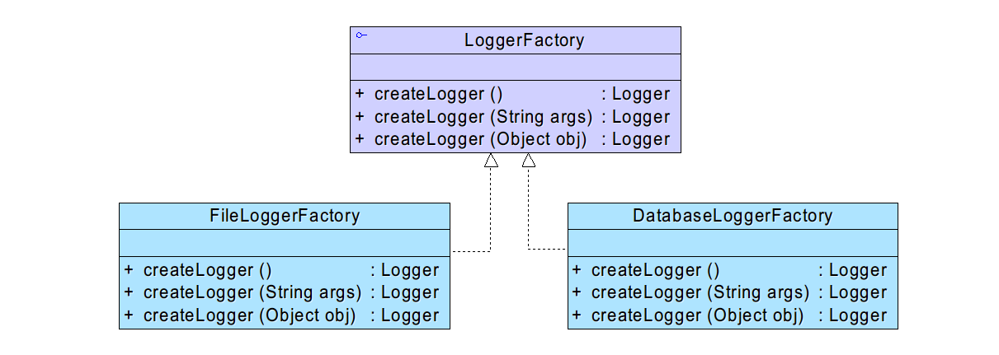
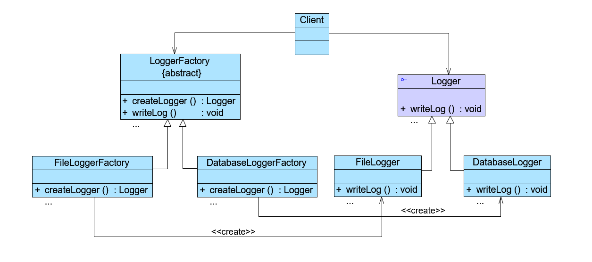

# 工厂方法模式

简单工厂模式虽然简单，但存在一个很严重的问题。当系统中需要引入新产品时，由于静态工厂方法通过所传入参数的不同来创建不同的产品，这必定要修改工厂类的源代码，将违背“开闭原则”，如何实现增加新产品而不影响已有代码？工厂方法模式应运而生。

## 工厂方法模式概述

在简单工厂模式中只提供一个工厂类，该工厂类处于对产品类进行实例化的中心位置，它需要知道每一个产品对象的创建细节，并决定何时实例化哪一个产品类。简单工厂模式最大的缺点是当有新产品要加入到系统中时，必须修改工厂类，需要在其中加入必要的业务逻辑，这违背了“开闭原则”。此外，在简单工厂模式中，所有的产品都由同一个工厂创建，工厂类职责较重，业务逻辑较为复杂，具体产品与工厂类之间的耦合度高，严重影响了系统的灵活性和扩展性，而工厂方法模式则可以很好地解决这一问题。

在工厂方法模式中，我们不再提供一个统一的工厂类来创建所有的产品对象，而是针对不同的产品提供不同的工厂，系统提供一个与产品等级结构对应的工厂等级结构。工厂方法模式定义如下：

工厂方法模式 ( Factory Method Pattern ) ：定义一个用于创建对象的接口，让子类决定将哪一个类实例化。工厂方法模式让一个类的实例化延迟到其子类。

工厂方法模式又简称为工厂模式 ( Factory Pattern )，又可称作虚拟构造器模式 ( Virtual Constructor Pattern ) 或多态工厂模式 (Polymorphic Factory Pattern)。工厂方法模式是一种类创建型模式。

## 工厂方法模式结构

工厂方法模式提供一个抽象工厂接口来声明抽象工厂方法，而由其子类来具体实现工厂方法，创建具体的产品对象。



在工厂方法模式结构图中包含如下几个角色：

+ Product（抽象产品）：它是定义产品的接口，是工厂方法模式所创建对象的超类型，也就是产品对象的公共父类。
+ ConcreteProduct（具体产品）：它实现了抽象产品接口，某种类型的具体产品由专门的具体工厂创建，具体工厂和具体产品之间一一对应。
+  Factory（抽象工厂）：在抽象工厂类中，声明了工厂方法 (Factory Method) ，用于返回一个产品。抽象工厂是工厂方法模式的核心，所有创建对象的工厂类都必须实现该接口。
+ ConcreteFactory（具体工厂）：它是抽象工厂类的子类，实现了抽象工厂中定义的工厂方法，并可由客户端调用，返回一个具体产品类的实例。

## 工厂方法模式实现

与简单工厂模式相比，工厂方法模式最重要的区别是引入了<font color="#FF666">抽象工厂</font>角色，抽象工厂可以是接口，也可以是抽象类或者具体类，其典型代码如下所示：

```java
interface Factory {
    public Product factoryMethod();
}
```

在抽象工厂中声明了工厂方法但并未实现工厂方法，具体产品对象的创建由其子类负责，客户端针对抽象工厂编程，可在运行时再指定<font color="#FF666">具体工厂</font>类，具体工厂类实现了工厂方法，不同的具体工厂可以创建不同的具体产品，其典型代码如下所示：

```java
class ConcreteFactory implements Factory {
    public Product factoryMethod() {
        return new ConcreteProduct();
    }
}
```

在实际使用时，具体工厂类在实现工厂方法时除了创建具体产品对象之外，还可以负责产品对象的初始化工作以及一些资源和环境配置工作，例如连接数据库、创建文件等。

在客户端代码中，只需关心工厂类即可，不同的具体工厂可以创建不同的产品，典型的客户端类代码片段如下所示：

```java
...
Factory factory;
factory = new ConcreteFactory(); //可通过配置文件和反射机制实现
Product product;
product = factory.factoryMethod();
...
```

可以通过配置文件来存储具体工厂类`ConcreteFactory`的类名，更换新的具体工厂时无须修改源代码，系统扩展更为方便。

## 工厂方法模式应用实例

### 实例说明

某系统运行日志记录器(Logger)可以通过多种途径保存系统的运行日志，例如通过文件记录或数据库记录，用户可以通过修改配置文件灵活地更换日志记录方式。在设计各类日志记录器时，开发人员发现需要对日志记录器进行一些初始化工作，初始化参数的设置过程较为复杂，而且某些参数的设置有严格的先后次序，否则可能会发生记录失败。

为了更好地封装记录器的初始化过程并保证多种记录器切换的灵活性，现使用工厂方法模式设计该系统。

### 实例类图



### 实例代码

1. Logger：日志记录器接口，充当抽象产品角色

   ```java
   //日志记录器接口，充当抽象产品角色
   public interface Logger {
   	public void writeLog();
   }
   ```

2. DatabaseLogger：数据库日志记录器，充当具体产品角色

   ```java
   //数据库日志记录器，充当具体产品角色
   public class DatabaseLogger implements Logger {
   	public void writeLog() {
   		System.out.println("数据库日志记录。");
   	}
   }
   ```

3. FileLogger：文件日志记录器，充当具体产品角色

   ```java
   //文件日志记录器，充当具体产品角色
   public class FileLogger implements Logger {
   	public void writeLog() {
   		System.out.println("文件日志记录。");
   	}
   }
   ```

4. LoggerFactory：日志记录器工厂接口，充当抽象工厂角色

   ```java
   //日志记录器工厂接口，充当抽象工厂角色
   public interface LoggerFactory {
   	public Logger createLogger(); //抽象工厂方法
   }
   ```

5. DatabaseLoggerFactory：数据库日志记录器工厂类，充当具体工厂角色

   ```java
   //数据库日志记录器工厂类，充当具体工厂角色
   public class DatabaseLoggerFactory implements LoggerFactory {
   	@Override
   	public Logger createLogger() {
   		//连接数据库，代码省略
   		//创建数据库日志记录器对象
   		Logger logger = new DatabaseLogger(); 
   		//初始化数据库日志记录器，代码省略
   		return logger;
   	}	
   }
   ```

6. FileLoggerFactory：文件日志记录器工厂类，充当具体工厂角色

   ```java
   //文件日志记录器工厂类，充当具体工厂角色
   public class FileLoggerFactory implements LoggerFactory {
   	@Override
   	public Logger createLogger() {
           //创建文件日志记录器对象
   		Logger logger = new FileLogger(); 
   		//创建文件，代码省略
   		return logger;
   	}	
   }
   ```

7. Client：客户端测试类

   ```java
   public class Client {
   	public static void main(String args[]) {
   		LoggerFactory factory;
   		Logger logger;
   		factory = new FileLoggerFactory(); //可引入配置文件实现
   
   		logger = factory.createLogger();
   		logger.writeLog();
   	}
   }
   ```

编译并运行程序，输出结果如下：

```
文件日志记录。
```

在未使用配置文件和反射机制之前，更换具体工厂类需修改<font color="#faa755">客户端</font>源代码，但无须修改类库代码

## 反射机制与配置文件

在客户端代码中将不再使用new关键字来创建工厂对象，而是将具体工厂类的类名存储在配置文件（如XML文件）中，通过读取配置文件获取类名字符串，再使用Java的反射机制，根据类名字符串生成对象。在整个实现过程中需要用到两个技术：Java反射机制与配置文件读取。 软件系统的配置文件通常为XML文件。

### Java反射机制

Java反射 (Java Reflection) 是指在程序运行时获取已知名称的类或已有对象的相关信息的一种机制，包括类的方法、属性、父类等信息，还包括实例的创建和实例类型的判断等。

在反射中 使用最多的类是Class，Class类的实例表示正在运行的Java应用程序中的类和接口，其`forName(String className)`方法可以返回与带有给定字符串名的类或接口相关联的 Class对象，再通过Class对象的`newInstance()`方法创建此对象所表示的类的一个新实例，即通过一个类名字符串得到类的实例。如创建一个字符串类型的对象，其代码如下：

```java
//通过类名生成实例对象并将其返回
Class c = Class.forName("java.lang.String");
Object obj = c.newInstance();
return obj;
```

### 配置文件

纯文本文件，例如XML文件，properties文件等

通常是XML文件，可以将类名存储在配置文件中，例如具体工厂类的类名

```xml
<!— config.xml -->
<?xml version="1.0"?>
<config>
    <className>designpatterns.factorymethod.FileLoggerFactory</className>
</config>
```

为了读取该配置文件并通过存储在其中的类名字符串反射生成对象， 创建名为`XMLUtil`的工具类，其详细代码如下所示：

```java
import javax.xml.parsers.*;
import org.w3c.dom.*;
import java.io.*;

public class XMLUtil {
	//该方法用于从XML配置文件中提取具体类类名，并返回一个实例对象
	public static Object getBean() {
		try {
			//创建DOM文档对象
			DocumentBuilderFactory dFactory = DocumentBuilderFactory.newInstance();
			DocumentBuilder builder = dFactory.newDocumentBuilder();
			Document doc;							
			doc = builder.parse(new File("src//designpatterns//factorymethod//config.xml")); 
		
			//获取包含类名的文本结点
			NodeList nl = doc.getElementsByTagName("className");
			Node classNode=nl.item(0).getFirstChild();
			String cName=classNode.getNodeValue();
          
			//通过类名生成实例对象并将其返回
			Class c=Class.forName(cName);
			Object obj=c.newInstance();
			return obj;
		}   
		catch(Exception e) {
			e.printStackTrace();
			return null;
		}
	}
}
```

有了`XMLUtil`类后，可以对日志记录器的客户端代码进行修改，不再直接使用`new`关键字来创建具体的工厂类，而是将具体工厂类的类名存储在XML文件中，再通过`XMLUtil`类的静态工厂方法`getBean()`方法进行对象的实例化，代码修改如下：

```java
public class Client {
	public static void main(String args[]) {
		LoggerFactory factory;
		Logger logger;
		factory = (LoggerFactory)XMLUtil.getBean(); //getBean()的返回类型为Object，需要进行强制类型转换

		logger = factory.createLogger();
		logger.writeLog();
	}
}
```

引入`XMLUtil`类和`XML`配置文件后，如果要增加新的日志记录方式，只需要执行如下几个步骤：

1. 新的日志记录器需要继承抽象日志记录器`Logger`。即增加一个新的<font color="#FF666">具体产品类</font>作为抽象产品类的子类。
2. 对应增加一个新的具体日志记录器工厂，继承抽象日志记录器工厂`LoggerFactory`，并实现其中的工厂方法`createLogger()`，设置好初始化参数和环境变量，返回具体日志记录器对象。即增加一个新的<font color="#FF666">具体工厂类</font>作为抽象工厂类的子类，该工厂用于创建新增的具体产品对象。
3. 修改配置文件config.xml，将新增的具体日志记录器工厂类的类名字符串替换原有工厂类类名字符串。即<font color="#FF666">修改配置</font>文件，用新的具体工厂类的类名字符串替换原有工厂类类名字符串。
4. 编译新增的具体日志记录器类和具体日志记录器工厂类，运行客户端测试类即可使用新的日志记录方式，而原有类库代码无须做任何修改，完全符合“开闭原则”。

通过上述重构可以使得系统更加灵活，由于很多设计模式都关注系统的可扩展性和灵活性，因此都定义了抽象层，在抽象层中声明业务方法，而将业务方法的实现放在实现层中。

## 工厂方法的重载

在某些情况下，可以通过多种方式来初始化同一个产品类。例如可以为各种日志记录器提供默认实现；还可以为数据库日志记录器提供数据库连接字符串，为文件日志记录器提供文件路径；也可以将参数封装在一个Object类型的对象中，通过Object对象将配置参数传入工厂类。

此时，可以提供一组重载的工厂方法，以不同的方式对产品对象进行创建。当然，对于同一个具体工厂而言，无论使用哪个工厂方法，创建的产品类型均要相同。



引入重载方法后，抽象工厂`LoggerFactory`的代码修改如下：

```java
public interface LoggerFactory {
    public Logger createLogger();
    public Logger createLogger(String args);
    public Logger createLogger(Object obj);
}
```

具体工厂类`DatabaseLoggerFactory`代码修改如下：

```java
public class DatabaseLoggerFactory implements LoggerFactory {
    public Logger createLogger() {
        //使用默认方式连接数据库，代码省略
        Logger logger = new DatabaseLogger();
        //初始化数据库日志记录器，代码省略
        return logger;
    }

    public Logger createLogger(String args) {
        //使用参数args作为连接字符串来连接数据库，代码省略
        Logger logger = new DatabaseLogger();
        //初始化数据库日志记录器，代码省略
        return logger;
    }

    public Logger createLogger(Object obj) {
        //使用封装在参数obj中的连接字符串来连接数据库，代码省略
        Logger logger = new DatabaseLogger();
        //使用封装在参数obj中的数据来初始化数据库日志记录器，代码省略
        return logger;
    }
}
//其他具体工厂类代码省略
```

在抽象工厂中定义多个重载的工厂方法，在具体工厂中实现了这些工厂方法，这些方法可以包含不同的业务逻辑，以满足对不同产品对象的需求。

## 工厂方法的隐藏

目的：为了进一步简化客户端的使用

实现：在工厂类中将直接调用产品类的业务方法，客户端无须调用工厂方法创建产品，直接通过工厂对象即可使用所创建的对象中的业务方法。



抽象工厂类LoggerFactory的代码修改如下：

```java
//将接口改为抽象类
public abstract class LoggerFactory {
    //在工厂类中直接调用日志记录器类的业务方法writeLog()
    public void writeLog() {
        Logger logger = this.createLogger();
        logger.writeLog();
    }
	
    public abstract Logger createLogger();	
}
```

客户端代码修改如下：

```java
public class Client {
    public static void main(String args[]) {
        LoggerFactory factory;
        factory = (LoggerFactory)XMLUtil.getBean();
        factory.writeLog(); //直接使用工厂对象来调用产品对象的业务方法
    }
}
```

通过将业务方法的调用移入工厂类，可以直接使用工厂对象来调用产品对象的业务方法，客户端无须直接使用工厂方法来创建对象。在某些情况下我们也可以使用这种设计方案。

## 工厂方法模式总结

工厂方法模式是简单工厂模式的延伸，它继承了简单工厂模式的优点，同时还弥补了简单工厂模式的不足。工厂方法模式是使用频率最高的设计模式之一，是很多开源框架和API类库的核心模式。

### 工厂模式优点

1. 工厂方法用来创建客户所需要的产品，同时还向客户隐藏了哪种具体产品类将被实例化这一细节。
2. 能够让工厂自主确定创建何种产品对象，而如何创建这个对象的细节则完全封装在具体工厂内部。
3. 在系统中加入新产品时，完全符合开闭原则。

### 工厂模式缺点

1. 系统中类的个数将成对增加，在一定程度上增加了系统的复杂度，会给系统带来一些额外的开销
2. 增加了系统的抽象性和理解难度

### 工厂模式的使用环境

1. 客户端不知道它所需要的对象的类（客户端不需要知道具体产品类的类名，只需要知道所对应的工厂即可，具体产品对象由具体工厂类创建）
2. 抽象工厂类通过其子类来指定创建哪个对象在工厂方法模式中，对于抽象工厂类只需要提供一个创建产品的接口，而由其子类来确定具体要创建的对象，利用面向对象的多态性和里氏代换原则，在程序运行时，子类对象将覆盖父类对象，从而使得系统更容易扩展。


