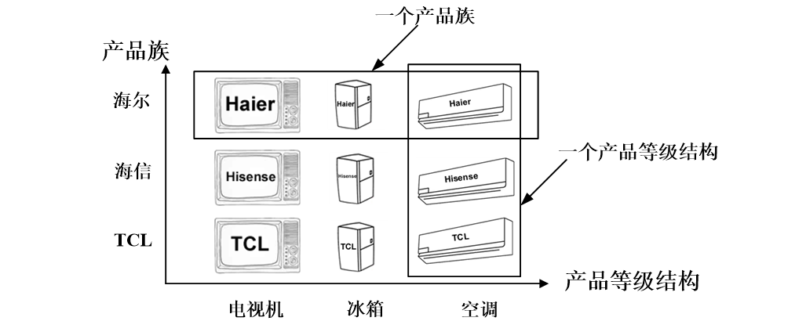
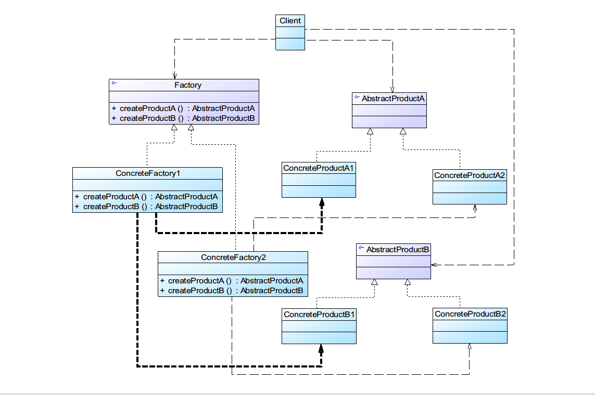
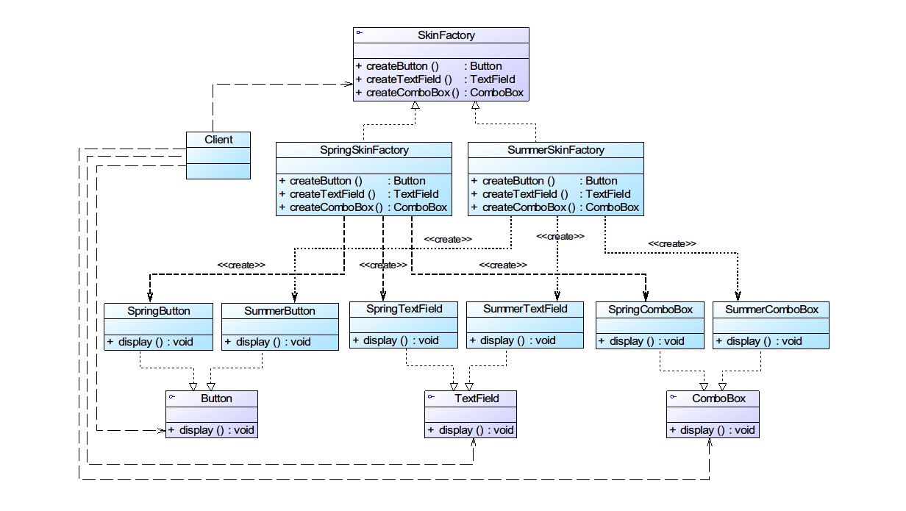

# 抽象工厂模式

## 产品等级结构与产品族

工厂方法模式通过引入工厂等级结构，解决了简单工厂模式中工厂类职责太重的问题，但由于工厂方法模式中的每个具体工厂只有一个或者一组重载的工厂方法，只能产生一种产品，可能会导致系统中存在大量的工厂类，势必会增加系统的开销。

此时，我们可以考虑将一些相关的产品组成一个“产品族”，由同一个工厂来统一生产，这就是我们本文将要学习的抽象工厂模式的基本思想。

为了跟好地理解抽象工厂模式，先引入两个概念。

1. <font color="#ea66a6">产品等级结构</font>：产品等级结构即产品的继承结构。，如一个抽象类是电视机，其子类有海尔电视机、海信电视机、TCL电视机，则抽象电视机与具体品牌的电视机之间构成了一个产品等级结构，抽象电视机是父类，而具体品牌的电视机是其子类。
2. <font color="#ea66a6">产品族</font>：在抽象工厂模式中，产品族是指由同一个工厂生产的，位于不同产品等级结构中的一组产品，如海尔电器工厂生产的海尔电视机、海尔电冰箱，海尔电视机位于电视机产品等级结构中，海尔电冰箱位于电冰箱产品等级结构中，海尔电视机、海尔电冰箱构成了一个产品族。



三个产品族，分属于三个不同的产品等级结构。

## 抽象工厂模式概述

当系统所提供的工厂生产的具体产品并不是一个简单的对象，而是多个位于不同产品等级结构、属于不同类型的具体产品时就可以使用抽象工厂模式。

抽象工厂模式是所有形式的工厂模式中最为抽象和最具一般性的一种形式。

+ 工厂方法模式：每个具体工厂只有一个或者一组重载的工厂方法，只能生产一种产品，可能会导致系统中存在大量的工厂类，势必会增加系统的开销。
+ 抽象工厂模式：一个工厂可以生产一系列产品（一族产品），极大减少了工厂类的数量。

<font color="#ea66a6">抽象工厂模式</font>：提供一个创建一系列相关或相互依赖对象的接口，而无须指定它们具体的类。又称为工具(Kit)模式。

抽象工厂模式中的具体工厂不只是创建一种产品，它负责创建一族产品。当一个工厂等级结构可以创建出分属于不同产品等级结构的一个产品族中的所有对象时，抽象工厂模式比工厂方法模式更为简单、更有效率。

## 抽象工厂模式的结构与实现

### 抽象工厂模式的结构



抽象工厂模式包含以下4个角色：

+ `AbstractFactory`（抽象工厂）：它声明了一组用于创建一族产品的方法，每一个方法对应一种产品。
+ `ConcreteFactory`（具体工厂）：它实现了在抽象工厂中声明的创建产品的方法，生成一组具体产品，这些产品构成了一个产品族，每一个产品都位于某个产品等级结构中。
+ `AbstractProduct`（抽象产品）：它为每种产品声明接口，在抽象产品中声明了产品所具有的业务方法。
+ `ConcreteProduct`（具体产品）：它定义具体工厂生产的具体产品对象，实现抽象产品接口中声明的业务方法。

### 抽象工厂模式的实现

在抽象工厂中声明了多个工厂方法，用于创建不同类型的产品，抽象工厂可以是接口，也可以是抽象类或者具体类，其典型代码如下所示：

```java
public interface AbstractFactory {
    public AbstractProductA createProductA(); //工厂方法一
    public AbstractProductB createProductB(); //工厂方法二
    ...
}
```

具体工厂实现了抽象工厂，每一个具体的工厂方法可以返回一个特定的产品对象，而同一个具体工厂所创建的产品对象构成了一个产品族。对于每一个具体工厂类，其典型代码如下所示：

```java
public class ConcreteFactory1 implements AbstractFactory {
    //工厂方法一
    public AbstractProductA createProductA() {
        return new ConcreteProductA1();
    }

    //工厂方法二
    public AbstractProductB createProductB() {
        return new ConcreteProductB1();
    }
    ...
}
```

与工厂方法模式一样，抽象工厂模式也可为每一种产品提供一组重载的工厂方法，以不同的方式对产品对象进行创建。

## 抽象工厂模式应用实例

某软件公司要开发一套界面皮肤库，可以对基于Java的桌面软件进行界面美化。用户在使用时可以通过菜单来选择皮肤，不同的皮肤将提供视觉效果不同的按钮、文本框、组合框等界面元素，例如春天(Spring)风格的皮肤将提供浅绿色的按钮、绿色边框的文本框和绿色边框的组合框，而夏天(Summer)风格的皮肤则提供浅蓝色的按钮、蓝色边框的文本框和蓝色边框的组合框。该皮肤库需要具备良好的灵活性和可扩展性，用户可以自由选择不同的皮肤，开发人员可以在不修改既有代码的基础上增加新的皮肤。现使用抽象工厂模式来设计该界面皮肤库。



`SkinFactory`接口充当抽象工厂，其子类`SpringSkinFactory`和`SummerSkinFactory`充当具体工厂，接口`Button`、`TextField`和`ComboBox`充当抽象产品，其子类`SpringButton`、 `SpringTextField`、`SpringComboBox`和`SummerButton`、`SummerTextField`、`SummerComboBox`充当具体产品。

1. `Button`：按钮接口，充当抽象产品

   ```java
   public interface Button {
   	public void display();
   }
   ```

2. `SpringButton`：Spring按钮类，充当具体产品

   ```java
   public class SpringButton implements Button {
   	public void display() {
   		System.out.println("显示浅绿色按钮。");
   	}
   }
   ```

3. `SummerButton`：Summer按钮类，充当具体产品
	
   ```java
   public class SummerButton implements Button {
   	public void display() {
   		System.out.println("显示浅蓝色按钮。");
   	}	
   }
   ```
   
4. `TextField`：文本框接口，充当抽象产品

   ```java
   public interface TextField {
   	public void display();
   }
   ```

5. `SpringTextField`：Spring文本框类，充当具体产品

   ```java
   public class SpringTextField implements TextField {
   	public void display() {
   		System.out.println("显示绿色边框文本框。");
   	}
   }
   ```

6. `SummerTextField`：Summer文本框类，充当具体产品

   ```java
   public class SummerTextField implements TextField {
   	public void display() {
   		System.out.println("显示蓝色边框文本框。");
   	}	
   }
   ```

7. `ComboBox`：组合框接口，充当抽象产品

   ```java
   public interface ComboBox {
   	public void display();
   }
   ```

8. `SpringComboBox`：Spring组合框类，充当具体产品

   ```java
   public class SpringComboBox implements ComboBox {
   	public void display() {
   		System.out.println("显示绿色边框组合框。");
   	}
   }
   ```

9. `SummerComboBox`：Summer组合框类，充当具体产品

   ```java
   public class SummerComboBox implements ComboBox {
   	public void display() {
   		System.out.println("显示蓝色边框组合框。");
   	}	
   }
   ```

10. `SkinFactory`：界面皮肤工厂接口，充当抽象工厂

    ```java
    public interface SkinFactory {
    	public Button createButton();
    	public TextField createTextField();
    	public ComboBox createComboBox();
    }
    ```

11. `SpringSkinFactory`：Spring皮肤工厂，充当具体工厂

    ```java
    public class SpringSkinFactory implements SkinFactory {
    	public Button createButton() {
    		return new SpringButton();
    	}
    
    	public TextField createTextField() {
    		return new SpringTextField();
    	}
    
    	public ComboBox createComboBox() {
    		return new SpringComboBox();
    	}
    }
    ```

12. `SummerSkinFactory`：Summer皮肤工厂，充当具体工厂

    ```java
    public class SummerSkinFactory implements SkinFactory {
    	public Button createButton() {
    		return new SummerButton();
    	}
    
    	public TextField createTextField() {
    		return new SummerTextField();
    	}
    
    	public ComboBox createComboBox() {
    		return new SummerComboBox();
    	}
    }
    ```

13. `XMLUtil`：工具类

    ```java
    import javax.xml.parsers.*;
    import org.w3c.dom.*;
    import java.io.*;
    
    public class XMLUtil {
    	//该方法用于从XML配置文件中提取具体类类名，并返回一个实例对象
    	public static Object getBean() {
    		try {
    			//创建DOM文档对象
    			DocumentBuilderFactory dFactory = DocumentBuilderFactory.newInstance();
    			DocumentBuilder builder = dFactory.newDocumentBuilder();
    			Document doc;							
    			doc =builder.parse(new File("src//designpatterns//abstractfactory//config.xml")); 
    		
    			//获取包含类名的文本结点
    			NodeList nl = doc.getElementsByTagName("className");
    			Node classNode=nl.item(0).getFirstChild();
    			String cName=classNode.getNodeValue();
            
    			//通过类名生成实例对象并将其返回
    			Class c=Class.forName(cName);
    			Object obj=c.newInstance();
    			return obj;
    		}   
    		catch(Exception e) {
    			e.printStackTrace();
    			return null;
    		}
    	}
    }
    ```

14. `Client`：客户端测试类

    ```java
    public class Client {
    	public static void main(String args[]) {
            //使用抽象层定义
    		SkinFactory factory;
    		Button bt;
    		TextField tf;
    		ComboBox cb;
    		factory = (SkinFactory)XMLUtil.getBean();
    		bt = factory.createButton();
    		tf = factory.createTextField();
    		cb = factory.createComboBox();
    		bt.display();
    		tf.display();
    		cb.display();
    	}
    }
    ```

编译并运行程序，输出结果如下：

```
显示浅蓝色按钮。
显示蓝色边框文本框。
显示蓝色边框组合框。
```

如果需要更换皮肤，只需修改配置文件即可，在实际环境中，我们可以提供可视化界面，例如菜单或者窗口来修改配置文件，用户无须直接修改配置文件。如果需要增加新的皮肤，只需增加一族新的具体组件并对应提供一个新的具体工厂，修改配置文件即可使用新的皮肤，原有代码无须修改，符合“开闭原则”。

## 开闭原则的倾斜性

使用抽象工厂模式设计了界面皮肤库，该皮肤库可以较为方便地增加新的皮肤，但是现在遇到一个非常严重的问题：由于设计时考虑不全面，忘记为单选按钮(`RadioButton`)提供不同皮肤的风格化显示，导致无论选择哪种皮肤，单选按钮都显得那么“格格不入”。设计人员决定向系统中增加单选按钮，但是发现原有系统居然不能够在符合“开闭原则”的前提下增加新的组件，原因是抽象工厂`SkinFactory`中根本没有提供创建单选按钮的方法，如果需要增加单选按钮，首先需要修改抽象工厂接口`SkinFactory`，在其中新增声明创建单选按钮的方法，然后逐个修改具体工厂类，增加相应方法以实现在不同的皮肤中创建单选按钮，此外还需要修改客户端，否则单选按钮无法应用于现有系统。

怎么办？答案是抽象工厂模式无法解决该问题，这也是抽象工厂模式最大的缺点。在抽象工厂模式中，增加新的产品族很方便，但是增加新的产品等级结构很麻烦，抽象工厂模式的这种性质称为“开闭原则”的倾斜性。“开闭原则”要求系统对扩展开放，对修改封闭，通过扩展达到增强其功能的目的，对于涉及到多个产品族与多个产品等级结构的系统，其功能增强包括两方面：

1. 增加产品族：对于增加新的产品族，抽象工厂模式很好地支持了“开闭原则”，只需要增加具体产品并对应增加一个新的具体工厂，对已有代码无须做任何修改。
2. 增加新的产品等级结构：对于增加新的产品等级结构，需要修改所有的工厂角色，包括抽象工厂类，在所有的工厂类中都需要增加生产新产品的方法，违背了“开闭原则”。

正因为抽象工厂模式存在“开闭原则”的倾斜性，它以一种倾斜的方式来满足“开闭原则”，为增加新产品族提供方便，但不能为增加新产品结构提供这样的方便，因此要求设计人员在设计之初就能够全面考虑，不会在设计完成之后向系统中增加新的产品等级结构，也不会删除已有的产品等级结构，否则将会导致系统出现较大的修改，为后续维护工作带来诸多麻烦。

## 抽象工厂模式总结

抽象工厂模式是工厂方法模式的进一步延伸，由于它提供了功能更为强大的工厂类并且具备较好的可扩展性，在软件开发中得以广泛应用，尤其是在一些框架和API类库的设计中，例如在Java语言的AWT（抽象窗口工具包）中就使用了抽象工厂模式，它使用抽象工厂模式来实现在不同的操作系统中应用程序呈现与所在操作系统一致的外观界面。抽象工厂模式也是在软件开发中最常用的设计模式之一。

### 抽象工厂模式优点

1. 抽象工厂模式隔离了具体类的生成，使得客户并不需要知道什么被创建。由于这种隔离，更换一个具体工厂就变得相对容易，所有的具体工厂都实现了抽象工厂中定义的那些公共接口，因此只需改变具体工厂的实例，就可以在某种程度上改变整个软件系统的行为。
2. 当一个产品族中的多个对象被设计成一起工作时，它能够保证客户端始终只使用同一个品族中的对象。
3. 增加新的产品族很方便，无须修改已有系统，符合“开闭原则”。

### 抽象工厂模式缺点

增加新的产品等级结构麻烦，需要对原有系统进行较大的修改，甚至需要修改抽象层代码，这显然会带来较大的不便，违背了“开闭原则”。

### 抽象工厂模式的适用环境

1.  一个系统不应当依赖于产品类实例如何被创建、组合和表达的细节，这对于所有类型的工厂模式都是很重要的，用户无须关心对象的创建过程，将对象的创建和使用解耦。
2. 系统中有多于一个的产品族，而<font color="#FF666">每次只使用其中某一产品族</font>。可以通过配置文件等方式来使得用户可以动态改变产品族，也可以很方便地增加新的产品族。
3. 属于同一个产品族的产品将在一起使用，这一约束必须在系统的设计中体现出来。同一个产品族中的产品可以是没有任何关系的对象，但是它们都具有一些共同的约束，如同一操作系统下的按钮和文本框，按钮与文本框之间没有直接关系，但它们都是属于某一操作系统的，此时具有一个共同的约束条件：操作系统的类型。
4.  产品等级结构稳定，设计完成之后，不会向系统中增加新的产品等级结构或者删除已有的产品等级结构。


