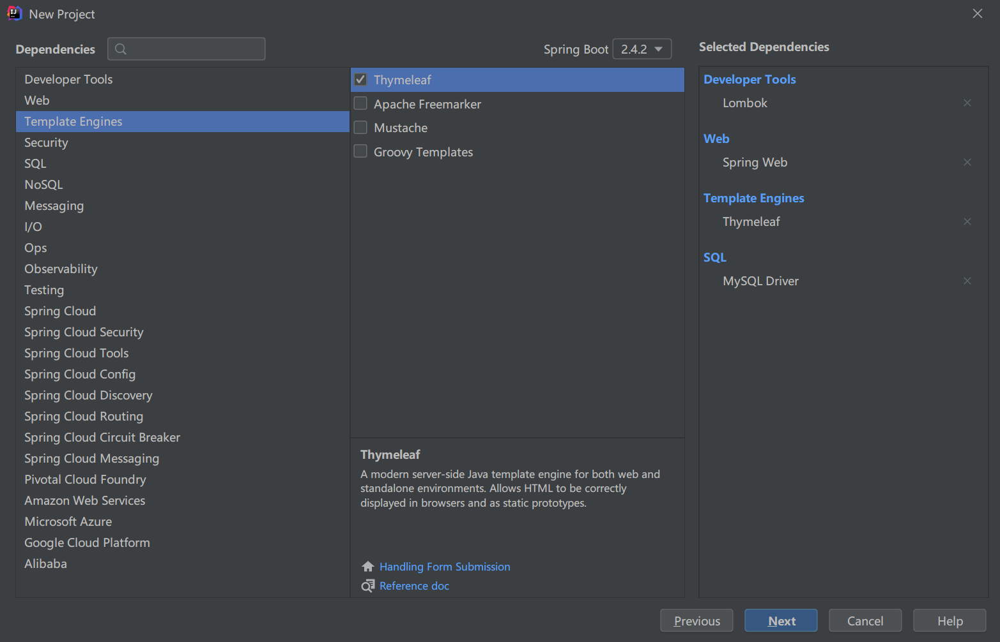

## 在线教育项目

JDK 8.0

SpringBoot 2.4.2



管理员使用：

+ 讲师管理模块
+ 课程分类管理模块
+ 课程管理模块
+ 统计分析模块
+ 订单管理
+ Banner管理
+ 权限管理

普通用户：

+ 首页数据显示
+ 讲师列表和详情
+ 课程列表、课程详情和在线播放
+ 登录和注册功能
+ 微信扫码登录
+ 微信扫码支付

有关技术 前后端分离

后端技术：

+ SpringBoot
+ SpringCloud
+ MybatisPlus
+ SpringSecurity
+ Redis
+ Jwt
+ OAuth2
+ easyExcel

前端技术：

+ Vue.js
+ ElementUI
+ Axios
+ Node.js

其他技术：

+ 阿里云OSS
+ Docker
+ jekins
+ 微信登录和支付
+ 阿里云短信服务
+ 阿里云视频点播服务

## MybatisPlus

### 主键生成策略

自动增长

UUID，随机唯一值：排序不方便

redis生成ID

snowflake算法（Mybatis默认）：全局唯一ID

```java
@Data
public class User {
    // 自动增长
    @TableId(type = IdType.AUTO)
    private Long id;
    private String name;
    private Integer age;
    private String email;

}
```

```java
@Data
public class User {
    // 自己输入
    // @TableId(type = IdType.INPUT)
    @TableId(type = IdType.INPUT)
    private Long id;
    private String name;
    private Integer age;
    private String email;

}
```

```java
@Data
public class User {
    // 随机唯一值
    @TableId(type = IdType.ASSIGN_UUID)
    private Long id;
    private String name;
    private Integer age;
    private String email;

}
```

```java
@Data
public class User {
    // 默认策略 snowflake算法
    @TableId(type = IdType.ASSIGN_ID)
    private Long id;
    private String name;
    private Integer age;
    private String email;

}
```

### 自动填充

不需要set到对象值，直接使用MybatisPlus

实现方式

1. 自动填充的属性上加上注解

```java
@Data
public class User {
    @TableId(type = IdType.ASSIGN_ID)
    private Long id;
    private String name;
    private Integer age;
    private String email;

    @TableField(fill = FieldFill.INSERT)
    private Date createTime;
    @TableField(fill = FieldFill.INSERT_UPDATE)
    private Date updateTime;

}
```

2. 自己创建类实现接口方法

```java
@Component
public class UserCreateUpdateHandler implements MetaObjectHandler {
    /**
     * 使用MybatisPlus实现添加操作,执行以下方法
     *
     * @param metaObject
     */
    @Override
    public void insertFill(MetaObject metaObject) {
        this.setFieldValByName("createTime", new Date(), metaObject);
        this.setFieldValByName("updateTime", new Date(), metaObject);
    }

    /**
     * 使用MybatisPlus实现修改操作,执行以下方法
     *
     * @param metaObject
     */
    @Override
    public void updateFill(MetaObject metaObject) {
        this.setFieldValByName("updateTime", new Date(), metaObject);
    }
}
```

### 乐观锁

丢失更新 解决方案：

+ 悲观锁，串
+ 乐观锁

实现乐观锁

表中添加字段int 类型version字段

```java
@Data
public class User {
    @TableId(type = IdType.ASSIGN_ID)
    private Long id;
    private String name;
    private Integer age;
    private String email;

    @TableField(fill = FieldFill.INSERT)
    private Date createTime;
    @TableField(fill = FieldFill.INSERT_UPDATE)
    private Date updateTime;

    @Version
    private Integer version;
}
```

配置乐观锁插件

3.4.0版本之前配置

```java
package com.halo.config;
import com.baomidou.mybatisplus.extension.plugins.OptimisticLockerInterceptor;

@Configuration
@MapperScan("com.halo.mapper")
public class MybatisPlusConfig {

    /**
     * 乐观锁插件
     */
    @Bean
    public OptimisticLockerInnerInterceptor optimisticLockerInnerInterceptor() {
        return new OptimisticLockerInnerInterceptor();
    }
}
```

3.4.0 之后插件配置

```java
@Configuration
@MapperScan("com.halo.mapper")
public class MybatisPlusConfig {
    @Bean
    public MybatisPlusInterceptor mybatisPlusInterceptor() {
        MybatisPlusInterceptor mybatisPlusInterceptor = new MybatisPlusInterceptor();
        mybatisPlusInterceptor.addInnerInterceptor(new OptimisticLockerInnerInterceptor());
        return mybatisPlusInterceptor;
    }
}
```

### 分页查询

3.4.0+插件配置

```java
@Configuration
@MapperScan("com.halo.mapper")
public class MybatisPlusConfig {
    @Bean
    public MybatisPlusInterceptor mybatisPlusInterceptor() {
        MybatisPlusInterceptor mybatisPlusInterceptor = new MybatisPlusInterceptor();
        //乐观锁
        mybatisPlusInterceptor.addInnerInterceptor(new OptimisticLockerInnerInterceptor());
        //分页配置
        mybatisPlusInterceptor.addInnerInterceptor(new PaginationInnerInterceptor());
        return mybatisPlusInterceptor;
    }
}
```

## 前端

### Babel

Babel是一个广泛使用的转码器，可以将ES6代码转为ES5代码，从而在现有环境执行执行。
这意味着，你可以现在就用 ES6 编写程序，而不用担心现有环境是否支持。

#### 安装

配置环境，Babel提供babel-cli工具，用于命令行转码。它的安装命令如下：

```shell
npm install -g babel-cli
```

查看是否安装成功

```shell
babel --version
```

#### Babel的使用

初始化项目

```shell
npm init -y
```

配置`.babelrc`

```json
{
    "presets": ["es2015"],
    "plugins": []
}
```

安装转码器 

```shell
npm install --save-dev babel-preset-es2015
```

转码操作

```shell
# 转码结果写入一个文件
# --out-file 或 -o 参数指定输出文件
babel src/example.js --out-file dist1/compiled.js
# 或者
babel src/example.js -o dist1/compiled.js

# 整个目录转码
# --out-dir 或 -d 参数指定输出目录
babel src --out-dir dist2
# 或者
babel src -d dist2
```

### Webpack

#### 全局安装

```
npm install -g webpack webpack-cli
```

检查是否安装成功

```
webpack -v
```

#### 创建示例

新建文件夹，使用npm初始化

```
npm init -y
```

创建src文件，在src下创建common.js，代码如下

```javascript
exports.info = function (str) {
    document.write(str);
}
```

在src下创建utils.js，代码如下

```javascript
exports.add = function (a, b) {
    return a + b;
}
```

在src下创建main.js，代码如下

```javascript
const common = require("./commom");
const utils = require("./utils");

common.info("Hello,world!" + utils.add(100, 200));
```

#### 打包

① 在项目根目录，创建配置文件`webpack.config.js`

```javascript
// Node.js内置模块
const path = require("path");
module.exports = {
    // 配置人口文件
    entry: "./src/main.js",
    output: {
        // 输出路径
        path: path.resolve(__dirname, "./dist"),
        // 输出文件
        filename:"bundle.js"
    }
}
```

② 使用命令执行打包

```
webpack
```

打包完成会出现警告

```
WARNING in configuration
The 'mode' option has not been set, webpack will fallback to 'production' for this value.
Set 'mode' option to 'development' or 'production' to enable defaults for each environment.
You can also set it to 'none' to disable any default behavior. 
Learn more: https://webpack.js.org/configuration/mode/
```

选择开发模式打包

```
webpack --mode=development
```

#### 测试

创建Html文件，引入js文件

```html
<!DOCTYPE html>
<html lang="en">
<head>
    <meta charset="UTF-8">
    <meta name="viewport" content="width=device-width, initial-scale=1.0">
    <title>Document</title>
</head>
<body>
    <script src="./dist/bundle.js"></script>
</body>
</html>
```

#### 打包CSS

① 创建css文件，在src下创建style.css文件

```css
body{
    background-color: darkcyan;
}
```

② main.js 中引入

```javascript
const common = require("./commom");
const utils = require("./utils");
require("./style.css");

common.info("Hello,world!" + utils.add(100, 200));
```

③ 安装CSS加载工具

```shell
npm install --save-dev style-loader css-loader
```

④ 修改`webpack.config.js`配置文件

```javascript
// Node.js内置模块
const path = require("path");
module.exports = {
    // 配置人口文件
    entry: "./src/main.js",
    output: {
        // 输出路径
        path: path.resolve(__dirname, "./dist"),
        // 输出文件
        filename: "bundle.js"
    },
    module: {
        rules: [
            {
            // 打包规则应用到以css结尾的文件上
            test: /\.css$/,
            use: ["style-loader", "css-loader"]
        }
        ]
    }
}
```

#### 其他方式

配置npm运行命令，修改`package.json`

```json
"scripts":{
    "dev":"webpack --mode-development"
}
```

运行npm命令执行打包

```
npm run dev
```

### 跨域问题

一个地址访问另外一个地址过程中，有三个地方任何一个方面不一样就会产生

+ 访问协议 http、https
+ IP地址
+ 端口号

#### 解决方式

① 在后端接口添加注解`@CrossOrigin`

② 使用网关解决