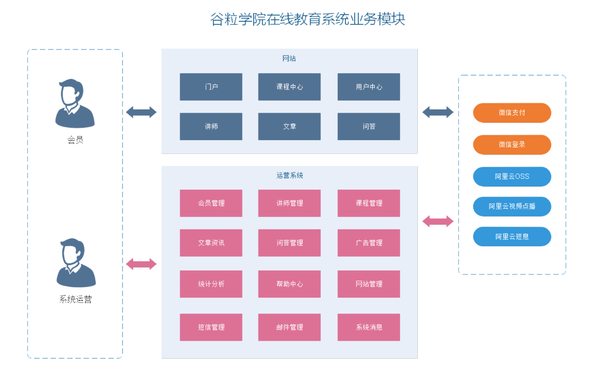

# 在线教育项目

## 项目介绍




管理员使用：讲师管理模块、课程分类管理模块、课程管理模块、统计分析模块、订单管理、Banner管理、权限管理

普通用户：首页数据显示、讲师列表和详情、课程列表、课程详情和在线播放、登录和注册功能、微信扫码登录、微信扫码支付

有关技术，前后端分离

后端技术：Spring Boot、Spring Cloud、Mybatis-Plus、Spring Security、Redis、Jwt、OAuth2、easyExcel

前端技术：Vue.js、elementUI、Axios、Node.js

其他技术：阿里云OSS、Docker、jekins、微信登录和支付、阿里云短信服务、阿里云视频点播服务

## Mybatis-Plus

### 特性

1. 无侵入：只做增强不做改变，引入它不会对现有工程产生影响，如丝般顺滑
2. 损耗小：启动即会自动注入基本 CURD，性能基本无损耗，直接面向对象操作
3. 强大的 CRUD 操作：内置通用 Mapper、通用 Service，仅仅通过少量配置即可实现单表大部分CRUD 操作，更有强大的条件构造器，满足各类使用需求
4. 支持 Lambda 形式调用：通过 Lambda 表达式，方便的编写各类查询条件，无需再担心字段写错
5. 支持多种数据库：支持 MySQL、MariaDB、Oracle、DB2、H2、HSQL、SQLite、Postgre、SQLServer2005、SQLServer 等多种数据库
6. 支持主键自动生成：支持多达 4 种主键策略（内含分布式唯一 ID 生成器 - Sequence），可自由置，完美解决主键问题
7. 支持 XML 热加载：Mapper 对应的 XML 支持热加载，对于简单的 CRUD 操作，甚至可以无 XML 启动
8. 支持 ActiveRecord 模式：支持 ActiveRecord 形式调用，实体类只需继承 Model 类即可进行强大的 CRUD 操作
9. 支持自定义全局通用操作：支持全局通用方法注入（ Write once, use anywhere ）
10. 支持关键词自动转义：支持数据库关键词（order、key......）自动转义，还可自定义关键词
11. 内置代码生成器：采用代码或者 Maven 插件可快速生成 Mapper 、 Model 、 Service 、 Controller 层代码，支持模板引擎，更有超多自定义配置等您来使用
12. 内置分页插件：基于 MyBatis 物理分页，开发者无需关心具体操作，配置好插件之后，写分页等同于普通 List 查询
13. 内置性能分析插件：可输出 SQL 语句以及其执行时间，建议开发测试时启用该功能，能快速揪出慢查询
14. 内置全局拦截插件：提供全表 delete 、 update 操作智能分析阻断，也可自定义拦截规则，预防误操作
15. 内置 SQL 注入剥离器：支持 SQL 注入剥离，有效预防 SQL 注入攻击

### 快速入门

#### 建立数据库

使用脚本创建mybatis_plus数据库，并且建立 User 表

```sql
CREATE SCHEMA mybatis_plus;
USE mybatis_plus;
DROP TABLE IF EXISTS user;
CREATE TABLE user
(
 id BIGINT(20) NOT NULL COMMENT '主键ID',
 name VARCHAR(30) NULL DEFAULT NULL COMMENT '姓名',
 age INT(11) NULL DEFAULT NULL COMMENT '年龄',
 email VARCHAR(50) NULL DEFAULT NULL COMMENT '邮箱',
 PRIMARY KEY (id)
);
INSERT INTO user (id, name, age, email) VALUES
(1, 'Jone', 18, 'test1@baomidou.com'),
(2, 'Jack', 20, 'test2@baomidou.com'),
(3, 'Tom', 28, 'test3@baomidou.com'),
(4, 'Sandy', 21, 'test4@baomidou.com'),
(5, 'Billie', 24, 'test5@baomidou.com');
```

#### 创建项目

创建普通的Spring Boot项目，pom.xml 中添加以下依赖

```xml
<dependencies>
    <dependency>
        <groupId>org.springframework.boot</groupId>
        <artifactId>spring-boot-starter</artifactId>
    </dependency>
    <!--mybatis-plus-->
    <dependency>
        <groupId>com.baomidou</groupId>
        <artifactId>mybatis-plus-boot-starter</artifactId>
        <version>3.4.2</version>
    </dependency>
    <!--mysql-->
    <dependency>
        <groupId>mysql</groupId>
        <artifactId>mysql-connector-java</artifactId>
        <version>8.0.21</version>
    </dependency>
    <!--lombok用来简化实体类-->
    <dependency>
        <groupId>org.projectlombok</groupId>
        <artifactId>lombok</artifactId>
        <version>1.18.16</version>
    </dependency>
    <dependency>
        <groupId>org.springframework.boot</groupId>
        <artifactId>spring-boot-starter-test</artifactId>
        <scope>test</scope>
    </dependency>
</dependencies>
```

注意：引入 MyBatis-Plus 之后请不要再次引入 MyBatis 以及 MyBatis-Spring，以避免因版本差异导致的问题。

 application.properties 配置文件中添加 MySQL 数据库的相关配置：

```properties
# MySQL5 数据库连接
spring.datasource.driver-class-name=com.mysql.jdbc.Driver
spring.datasource.url=jdbc:mysql://localhost:3306/mybatis_plus
spring.datasource.username=root
spring.datasource.password=root
```

```properties
# MySQL8 以上(spring boot 2.1)
spring.datasource.driver-class-name=com.mysql.cj.jdbc.Driver
spring.datasource.url=jdbc:mysql://localhost:3306/mybatis_plus?serverTimezone=GMT%2B8
spring.datasource.username=root
spring.datasource.password=root
```

1. 这里的 url 使用了 `?serverTimezone=GMT%2B8` 后缀，因为Spring Boot 2.1 集成了 8.0版本的 JDBC 驱动， 这个版本的 JDBC 驱动需要添加这个后缀，否则运行测试用例报告如下错误：
    ```
    java.sql.SQLException: The server time zone value 'Öйú±ê׼ʱ¼ä' is unrecognized or represents more
    ```
    
2. 这里的 driver-class-name 使用了 `com.mysql.cj.jdbc.Driver` ，在 JDBC 8 中 建议使用这个驱动，之前的`com.mysql.jdbc.Driver` 已经被废弃，否则运行测试用例的时候会有 WARN 信息。

#### 编写基础代码

在 Spring Boot 启动类中添加 `@MapperScan` 注解，扫描 Mapper 文件夹，扫描的包名根据实际情况修改。

```java
@SpringBootApplication
@MapperScan("demo.halo.mapper")
public class MybatisPlusApplication {
    public static void main(String[] args) {
        SpringApplication.run(MybatisPlusApplication.class, args);
    }
}
```

创建包 entity 编写实体类 User.java（此处使用了 Lombok 简化代码）

```java
@Data
public class User {
    private Long id;
    private String name;
    private Integer age;
    private String email;
}
```

创建包 mapper 编写Mapper 接口： UserMapper.java

```java
public interface UserMapper extends BaseMapper<User> {
    
}
```

#### 开始使用

添加测试类，进行功能测试：

```java
@SpringBootTest
class QuickStartTests {

    @Resource
    private UserMapper userMapper;

    // 查询User表的所有数据
    @Test
    public void testSelectList() {
        System.out.println(("====== selectAll method test ======"));
        List<User> users = userMapper.selectList(null);
        users.forEach(System.out::println);
    }
}
```

控制台输出

```
====== selectAll method test ======
User(id=1, name=Jone, age=18, email=test1@baomidou.com)
User(id=2, name=Jack, age=20, email=test2@baomidou.com)
User(id=3, name=Tom, age=28, email=test3@baomidou.com)
User(id=4, name=Sandy, age=21, email=test4@baomidou.com)
User(id=5, name=Billie, age=24, email=test5@baomidou.com)
```

Tips：如果 Mapper 注入使用 `@Autowired`，IDEA在 `userMapper` 处报错，因为找不到注入的对象，因为类是动态创建的，但是程序可以正确的执行。为了避免报错，可以在 DAO 层 的接口上添加 @Repository 注解。

```java
@Autowired
private UserMapper userMapper;
```

```java
@Repository
public interface UserMapper extends BaseMapper<User> {

}
```

### 配置日志

在配置文件中添加以下内容，用于查看SQL输出日志：

```properties
# MybatisPlus日志
mybatis-plus.configuration.log-impl=org.apache.ibatis.logging.stdout.StdOutImpl
```

### 插入操作


### 主键生成策略

自动增长

UUID，随机唯一值：排序不方便

redis生成ID

snowflake算法（Mybatis默认）：全局唯一ID

```java
@Data
public class User {
    // 自动增长
    @TableId(type = IdType.AUTO)
    private Long id;
    private String name;
    private Integer age;
    private String email;

}
```

```java
@Data
public class User {
    // 自己输入
    // @TableId(type = IdType.INPUT)
    @TableId(type = IdType.INPUT)
    private Long id;
    private String name;
    private Integer age;
    private String email;

}
```

```java
@Data
public class User {
    // 随机唯一值
    @TableId(type = IdType.ASSIGN_UUID)
    private Long id;
    private String name;
    private Integer age;
    private String email;

}
```

```java
@Data
public class User {
    // 默认策略 snowflake算法
    @TableId(type = IdType.ASSIGN_ID)
    private Long id;
    private String name;
    private Integer age;
    private String email;

}
```

### 自动填充

不需要set到对象值，直接使用MybatisPlus

实现方式

1. 自动填充的属性上加上注解

```java
@Data
public class User {
    @TableId(type = IdType.ASSIGN_ID)
    private Long id;
    private String name;
    private Integer age;
    private String email;

    @TableField(fill = FieldFill.INSERT)
    private Date createTime;
    @TableField(fill = FieldFill.INSERT_UPDATE)
    private Date updateTime;

}
```

2. 自己创建类实现接口方法

```java
@Component
public class UserCreateUpdateHandler implements MetaObjectHandler {
    /**
     * 使用MybatisPlus实现添加操作,执行以下方法
     *
     * @param metaObject
     */
    @Override
    public void insertFill(MetaObject metaObject) {
        this.setFieldValByName("createTime", new Date(), metaObject);
        this.setFieldValByName("updateTime", new Date(), metaObject);
    }

    /**
     * 使用MybatisPlus实现修改操作,执行以下方法
     *
     * @param metaObject
     */
    @Override
    public void updateFill(MetaObject metaObject) {
        this.setFieldValByName("updateTime", new Date(), metaObject);
    }
}
```

### 乐观锁

丢失更新 解决方案：

+ 悲观锁，串
+ 乐观锁

实现乐观锁

表中添加字段int 类型version字段

```java
@Data
public class User {
    @TableId(type = IdType.ASSIGN_ID)
    private Long id;
    private String name;
    private Integer age;
    private String email;

    @TableField(fill = FieldFill.INSERT)
    private Date createTime;
    @TableField(fill = FieldFill.INSERT_UPDATE)
    private Date updateTime;

    @Version
    private Integer version;
}
```

配置乐观锁插件

3.4.0版本之前配置

```java
package com.halo.config;
import com.baomidou.mybatisplus.extension.plugins.OptimisticLockerInterceptor;

@Configuration
@MapperScan("com.halo.mapper")
public class MybatisPlusConfig {

    /**
     * 乐观锁插件
     */
    @Bean
    public OptimisticLockerInnerInterceptor optimisticLockerInnerInterceptor() {
        return new OptimisticLockerInnerInterceptor();
    }
}
```

3.4.0 之后插件配置

```java
@Configuration
@MapperScan("com.halo.mapper")
public class MybatisPlusConfig {
    @Bean
    public MybatisPlusInterceptor mybatisPlusInterceptor() {
        MybatisPlusInterceptor mybatisPlusInterceptor = new MybatisPlusInterceptor();
        mybatisPlusInterceptor.addInnerInterceptor(new OptimisticLockerInnerInterceptor());
        return mybatisPlusInterceptor;
    }
}
```

### 分页查询

3.4.0+插件配置

```java
@Configuration
@MapperScan("com.halo.mapper")
public class MybatisPlusConfig {
    @Bean
    public MybatisPlusInterceptor mybatisPlusInterceptor() {
        MybatisPlusInterceptor mybatisPlusInterceptor = new MybatisPlusInterceptor();
        //乐观锁
        mybatisPlusInterceptor.addInnerInterceptor(new OptimisticLockerInnerInterceptor());
        //分页配置
        mybatisPlusInterceptor.addInnerInterceptor(new PaginationInnerInterceptor());
        return mybatisPlusInterceptor;
    }
}
```

## 前端

### Babel

Babel是一个广泛使用的转码器，可以将ES6代码转为ES5代码，从而在现有环境执行执行。
这意味着，你可以现在就用 ES6 编写程序，而不用担心现有环境是否支持。

#### 安装

配置环境，Babel提供babel-cli工具，用于命令行转码。它的安装命令如下：

```shell
npm install -g babel-cli
```

查看是否安装成功

```shell
babel --version
```

#### Babel的使用

初始化项目

```shell
npm init -y
```

配置`.babelrc`

```json
{
    "presets": ["es2015"],
    "plugins": []
}
```

安装转码器 

```shell
npm install --save-dev babel-preset-es2015
```

转码操作

```shell
# 转码结果写入一个文件
# --out-file 或 -o 参数指定输出文件
babel src/example.js --out-file dist1/compiled.js
# 或者
babel src/example.js -o dist1/compiled.js

# 整个目录转码
# --out-dir 或 -d 参数指定输出目录
babel src --out-dir dist2
# 或者
babel src -d dist2
```

### Webpack

#### 全局安装

```
npm install -g webpack webpack-cli
```

检查是否安装成功

```
webpack -v
```

#### 创建示例

新建文件夹，使用npm初始化

```
npm init -y
```

创建src文件，在src下创建common.js，代码如下

```javascript
exports.info = function (str) {
    document.write(str);
}
```

在src下创建utils.js，代码如下

```javascript
exports.add = function (a, b) {
    return a + b;
}
```

在src下创建main.js，代码如下

```javascript
const common = require("./commom");
const utils = require("./utils");

common.info("Hello,world!" + utils.add(100, 200));
```

#### 打包

① 在项目根目录，创建配置文件`webpack.config.js`

```javascript
// Node.js内置模块
const path = require("path");
module.exports = {
    // 配置人口文件
    entry: "./src/main.js",
    output: {
        // 输出路径
        path: path.resolve(__dirname, "./dist"),
        // 输出文件
        filename:"bundle.js"
    }
}
```

② 使用命令执行打包

```
webpack
```

打包完成会出现警告

```
WARNING in configuration
The 'mode' option has not been set, webpack will fallback to 'production' for this value.
Set 'mode' option to 'development' or 'production' to enable defaults for each environment.
You can also set it to 'none' to disable any default behavior. 
Learn more: https://webpack.js.org/configuration/mode/
```

选择开发模式打包

```
webpack --mode=development
```

#### 测试

创建Html文件，引入js文件

```html
<!DOCTYPE html>
<html lang="en">
<head>
    <meta charset="UTF-8">
    <meta name="viewport" content="width=device-width, initial-scale=1.0">
    <title>Document</title>
</head>
<body>
    <script src="./dist/bundle.js"></script>
</body>
</html>
```

#### 打包CSS

① 创建css文件，在src下创建style.css文件

```css
body{
    background-color: darkcyan;
}
```

② main.js 中引入

```javascript
const common = require("./commom");
const utils = require("./utils");
require("./style.css");

common.info("Hello,world!" + utils.add(100, 200));
```

③ 安装CSS加载工具

```shell
npm install --save-dev style-loader css-loader
```

④ 修改`webpack.config.js`配置文件

```javascript
// Node.js内置模块
const path = require("path");
module.exports = {
    // 配置人口文件
    entry: "./src/main.js",
    output: {
        // 输出路径
        path: path.resolve(__dirname, "./dist"),
        // 输出文件
        filename: "bundle.js"
    },
    module: {
        rules: [
            {
            // 打包规则应用到以css结尾的文件上
            test: /\.css$/,
            use: ["style-loader", "css-loader"]
        }
        ]
    }
}
```

#### 其他方式

配置npm运行命令，修改`package.json`

```json
"scripts":{
    "dev":"webpack --mode-development"
}
```

运行npm命令执行打包

```
npm run dev
```

### 跨域问题

一个地址访问另外一个地址过程中，有三个地方任何一个方面不一样就会产生

+ 访问协议 http、https
+ IP地址
+ 端口号

#### 解决方式

① 在后端接口添加注解`@CrossOrigin`

② 使用网关解决


