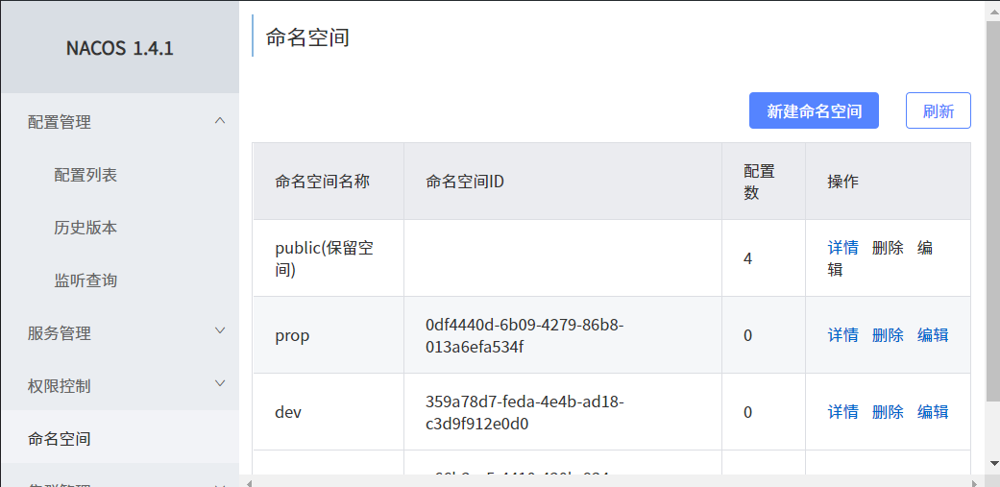

开发环境准备


## 整合MybatisPlus

导入依赖

```xml
<dependency>
    <groupId>com.baomidou</groupId>
    <artifactId>mybatis-plus-boot-starter</artifactId>
    <version>3.4.2</version>
</dependency>
```

配置

1. 配置数据源

   1. 导入数据库驱动(对应版本)

      ```xml
      <dependency>
          <groupId>mysql</groupId>
          <artifactId>mysql-connector-java</artifactId>
          <version>8.0.17</version>
      </dependency>
      ```

   2. 在`application.yml`中配置数据源信息

      ```yaml
      spring:
        datasource:
          username: root
          password: root
          url: jdbc:mysql://81.70.151.52:3306/halo_pms
          driver-class-name: com.mysql.cj.jdbc.Driver
      ```

2. 配置MybatisPlus

   1. 在主程序中使用`@MapperScan`

      ```java
      @MapperScan("com.halo.mall.product.dao")
      @SpringBootApplication
      public class HalomallProductApplication {
      
          public static void main(String[] args) {
              SpringApplication.run(HalomallProductApplication.class, args);
          }
      
      }
      ```

   2. 在`application.yml`中配置SQL映射文件位置(不配置也会扫描默认位置)、调整主键自增

      ```yaml
      mybatis-plus:
        mapper-locations: classpath:/mapper/**/*.xml
        global-config:
          db-config:
            id-type: auto
      ```


## 整合SpringCloudAlibaba

```xml
<dependencyManagement>
    <dependencies>
        <dependency>
            <groupId>com.alibaba.cloud</groupId>
            <artifactId>spring-cloud-alibaba-dependencies</artifactId>
            <version>2.2.5.RELEASE</version>
            <type>pom</type>
            <scope>import</scope>
        </dependency>
    </dependencies>
</dependencyManagement>
```

### 注册中心 Nacos

1. 在common中添加依赖

    ```xml
     <dependency>
         <groupId>com.alibaba.cloud</groupId>
         <artifactId>spring-cloud-starter-alibaba-nacos-discovery</artifactId>
     </dependency>
    ```

2. 启动[Nacos](https://github.com/alibaba/nacos/releases)注册中心

3. 配置配置文件

   ```yml
   spring:
     cloud:
       nacos:
         discovery:
           server-addr: 127.0.0.1:8848
     application:
       name: halomall-xxx
   ```

4. 使用 `@EnableDiscoveryClient` 注解开启服务注册与发现功能

   ```java
   @SpringBootApplication
   @EnableDiscoveryClient
   public class ProviderApplication {
   
       public static void main(String[] args) {
           SpringApplication.run(Application.class, args);
       }
   }
   ```

### Feign 声明式远程调用

feign是一个声明式的HTTP客户端，他的目的就是让远程调用更加简单。给远程服务发的是HTTP请求。

会员服务想要远程调用优惠券服务，只需要给会员服务里引入openfeign依赖，他就有了远程调用其他服务的能力。

```xml
<dependency>
    <groupId>org.springframework.cloud</groupId>
    <artifactId>spring-cloud-starter-openfeign</artifactId>
</dependency>
```

在`CouponController`中增加如下的内容

```java
@RequestMapping("/member/list")
//全系统的所有返回都返回R
public R memberCoupons() {
    // 应该去数据库查用户对于的优惠券，但这个我们简化了，不去数据库查了，构造了一个优惠券给他返回
    CouponEntity couponEntity = new CouponEntity();
    //优惠券的名字
    couponEntity.setCouponName("满100-10");
    return R.ok().put("coupons", Arrays.asList(couponEntity));
}
```

想要远程调用的步骤：

1. 引入`OpenFeign`
2. 编写一个接口，接口告诉SpringCloud这个接口需要调用远程服务
   1. 在接口里声明`@FeignClient("halomall-coupon")`他是一个远程调用客户端且要调用`coupon`服务
   2. 要调用`coupon`服务的`/coupon/coupon/member/list`方法
3. 开启远程调用功能 `@EnableFeignClients`，要指定远程调用功能放的基础包

```java
@FeignClient("halomall-coupon")
public interface CouponFeignService {

    @RequestMapping("coupon/coupon/member/list")
    R memberCoupons();

}
```

### 配置中心 Nacos

`common`中添加依赖 `nacos`配置中心

```xml
<dependency>
     <groupId>com.alibaba.cloud</groupId>
     <artifactId>spring-cloud-starter-alibaba-nacos-config</artifactId>
 </dependency>
```

在coupons项目中创建`/src/main/resources/bootstrap.properties` ，这个文件是springboot里规定的，他优先级别`application.properties`高

```properties
# 改名字，对应nacos里的配置文件名
spring.application.name=halomall-coupon
spring.cloud.nacos.config.server-addr=127.0.0.1:8848
```

还是原来我们使用配置的方式，只不过优先级变了，所以匹配到了nacos的配置，配合`@Value`注解使用

```java
@RestController
@RequestMapping("coupon/coupon")
public class CouponController {
    @Autowired
    private CouponService couponService;

    //从application.properties中获取
    //不要写user.name，这里取系统环境里的变量
    @Value("${coupon.user.name}")
    private String name;
    @Value("${coupon.user.age}")
    private Integer age;
    @RequestMapping("/test")
    public R test(){

        return R.ok().put("name",name).put("age",age);
    }
```

但是如何修改？实际生产中不能重启应用。将配置交给配置中心。配置中心一改其他全改。

在coupon的控制层上加`@RefreshScope`

```java
@RefreshScope
@RestController
@RequestMapping("coupon/coupon")
public class CouponController {}
```

重启后，在nacos浏览器里修改配置，修改就可以观察到能动态修改了


nacos的配置内容优先于项目本地的配置内容。

#### 配置中心进阶

在nacos浏览器中还可以配置：

1. 命名空间：用作配置隔离。（一般每个微服务一个命名空间）

  1. 默认public。默认新增的配置都在public空间下

  2. 开发、测试、开发可以用命名空间分割。properties每个空间有一份。

  3. 在bootstrap.properties里配置

    ```properties
    # 可以选择对应的命名空间 
    # 写上对应环境的命名空间ID
    spring.cloud.nacos.config.namespace=b176a68a-6800-4648-833b-be10be8bab00
    ```

  4. 也可以为每个微服务配置一个命名空间，微服务互相隔离



2. 配置集：一组相关或不相关配置项的集合。

3. 配置集ID：类似于配置文件名，即Data ID

4. 配置分组：默认所有的配置集都属于DEFAULT_GROUP。

   ```properties
   # 更改配置分组
   spring.cloud.nacos.config.group=DEFAULT_GROUP
   ```

最终方案：每个微服务创建自己的命名空间，然后使用配置分组区分环境（dev/test/prod）

#### 加载多配置集

我们要把原来`application.yml`里的内容都分文件抽离出去。我们在nacos里创建好后，在`coupons`里指定要导入的配置即可。

在`bootstrap.properties`在其中用数组`spring.cloud.nacos.config.extension-configs[]`写明每个配置集

```properties
spring.application.name=halomall-coupon
spring.cloud.nacos.config.server-addr=81.70.151.52:8848
spring.cloud.nacos.config.namespace=258e6980-7d54-4dad-b388-a09de6241093
spring.cloud.nacos.config.group=prod
spring.cloud.nacos.config.ext-config[0].data-id=datasource.yaml
spring.cloud.nacos.config.ext-config[0].group=dev
spring.cloud.nacos.config.ext-config[0].refresh=true
spring.cloud.nacos.config.ext-config[1].data-id=mybatis.yaml
spring.cloud.nacos.config.ext-config[1].group=dev
spring.cloud.nacos.config.ext-config[1].refresh=true
spring.cloud.nacos.config.ext-config[2].data-id=others.yaml
spring.cloud.nacos.config.ext-config[2].group=dev
spring.cloud.nacos.config.ext-config[2].refresh=true
```

只需要在`bootstrap.properties`说明加载配置中心中的哪些文件，即可在微服务中任何配置信息都可以放在配置中心中

以前SpringBoot任何从配置文件获取值的方法，都可以使用（`@Value`、`@ConfigurationProperties `）

### 网关 Gateway


动态上下线：发送请求需要知道商品服务的地址，如果商品服务器有1、2、3服务器，1号掉线后，还得改，所以需要网关动态地管理，他能从注册中心中实时地感知某个服务上线还是下线。【先通过网关，网关路由到服务提供者】

拦截：请求也要加上询问权限，看用户有没有权限访问这个请求，也需要网关。

网关是请求流量的入口，常用功能包括路由转发，权限校验，限流控制等。springcloud gateway第二代网关取代了zuul 网关。

https://spring.io/projects/spring-cloud-gateway

参考手册：https://cloud.spring.io/spring-cloud-gateway/2.2.x/reference/html/

三大核心概念：

+ Route: The basic building block of the gateway. It is defined by an ID, a destination URI, a collection of predicates断言, and a collection of filters. A route is matched if the aggregate predicate is true.

  发一个请求给网关，网关要将请求路由到指定的服务。路由有id，目的地uri，断言的集合，匹配了断言就能到达指定位置，

+ Predicate断言: This is a Java 8 Function Predicate. The input type is a Spring Framework ServerWebExchange. This lets you match on anything from the HTTP request, such as headers or parameters.

  就是java里的断言函数，匹配请求里的任何信息，包括请求头等。根据请求头路由哪个服务

+ Filter: These are instances of Spring Framework GatewayFilter that have been constructed with a specific factory. Here, you can modify requests and responses before or after sending the downstream request.

  过滤器请求和响应都可以被修改。

客户端发请求给服务端。中间有网关。先交给映射器，如果能处理就交给handler处理，然后交给一系列filer，然后给指定的服务，再返回回来给客户端。


```yaml
spring:
  cloud:
    gateway:
      routes:
        - id: test_route
          uri: https://www.baidu.com
          predicates:
            - Query=url,baidu
```


## 前端技术栈

### ES6

#### `let`

- `let`不会作用到`{}`外，`var`会越域跳到`{}`外

  ```javascript
  {
      var a = 1;
      let b = 2;
  }
  console.log(a);  // 1
  console.log(b);  // ReferenceError: b is not defined
  ```

- `var`可以多次声明同一变量，`let`会报错

  ```javascript
  var m = 1
  var m = 2
  let n = 3
  let n = 4
  console.log(m)  // 2
  console.log(n)  // Identifier 'n' has already been declared
  ```

- `var`定义之前可以使用，`let`定义之前不可使用。（变量提升问题）

  ```javascript
  console.log(x);  // undefined
  var x = 10;
  console.log(y);   //ReferenceError: y is not defined
  let y = 20;
  ```

- `const` 声明之后不允许改变、一但声明必须初始化，否则会报错

  ```javascript
  const a = 1;
  a = 3; //Uncaught TypeError: Assignment to constant variable.
  ```

#### 解构表达式

1. 数组解构
    ```javascript
    let arr = [1,2,3];
    // let a = arr[0];
    // let b = arr[1];
    // let c = arr[2];
    
    // 替换为
let [a,b,c] = arr;
    
    console.log(a,b,c)
    ```

2. 对象解构

   ```javascript
   const person = {
       name: "jack",
       age: 21,
       language: ['java', 'js', 'css']
   }
   // const name = person.name;
   // const age = person.age;
   // const language = person.language;
   
   // 替换为
   // const { name, age, language } = person;
   const { name: abc, age, language } = person;
   console.log(abc, age, language)
   ```

#### 字符串扩展

1. 新增API

    ```javascript
    let str = "hello.vue";
    console.log(str.startsWith("hello"));//true
    console.log(str.endsWith(".vue"));//true
    console.log(str.includes("e"));//true
    console.log(str.includes("hello"));//true
    ```
    
2. 字符串模板

    ```javascript
    let ss = `<div><span>hello world<span></div>`;
    console.log(ss);
    ```

    字符串插入变量和表达式。变量名写在 `${}` 中，`${}` 中可以放入 JavaScript 表达式。

    ```javascript
    function fun() {
        return "这是一个函数"
    }
    
    let info = `我是${name}，今年${age + 10}了, 我想说： ${fun()}`;
    console.log(info);
    ```

#### 函数优化

1. 函数参数的默认值

   ```javascript
   //在ES6以前，我们无法给一个函数参数设置默认值，只能采用变通写法：
   function add(a, b) {
       // 判断b是否为空，为空就给默认值1
       b = b || 1;
       return a + b;
   }
   // 传一个参数
   console.log(add(10));
   
   //现在可以这么写：直接给参数写上默认值，没传就会自动使用默认值
   function add2(a, b = 1) {
       return a + b;
   }
   console.log(add2(20));
   ```

2. 不定参数

   ```javascript
   function fun(...values) {
       console.log(values.length)
   }
   fun(1, 2) //2
   fun(1, 2, 3, 4) //4
   ```

3. 箭头函数

   ```javascript
   //以前声明一个方法,一个形参
    var printOld = function (obj) {
        console.log(obj);
    }
    printOld("hello");
   
    var printNew = obj => console.log(obj);
   printNew("hello");
   
   // 多个形参
   var sum = function (a, b) {
       c = a + b;
       return a + c;
   }
   
   var sum2 = (a, b) => a + b;
   console.log(sum2(11, 12));
   
   var sum3 = (a, b) => {
       c = a + b;
       return a + c;
   }
   console.log(sum3(10, 20))
   ```

   ```javascript
   const person = {
       name: "jack",
       age: 21,
       language: ['java', 'js', 'css']
   }
   
   function hello(person) {
       console.log("hello," + person.name)
   }
   
   //箭头函数+解构
   var hello2 = ({name}) => console.log("hello," + name);
   hello2(person);
   ```

#### 对象优化

1. 新增API

   ```javascript
   const person = {
       name: "jack",
       age: 21,
       language: ['java', 'js', 'css']
   }
   
   console.log(Object.keys(person));//["name", "age", "language"]
   console.log(Object.values(person));//["jack", 21, Array(3)]
   console.log(Object.entries(person));//[Array(2), Array(2), Array(2)]
   ```

   ```javascript
   const target = { a: 1 };
   const source1 = { b: 2 };
   const source2 = { c: 3 };
   
   // source1、source2合并到target
   Object.assign(target, source1, source2);
   console.log(target);//{a:1,b:2,c:3}
   ```

2. 声明对象简写

   ```javascript
   const age = 23
   const name = "张三"
   // 以前的写法
   const person1 = { age: age, name: name }
   // 如果属性名和其对应的属性值的变量名相同可以简写
   const person2 = { age, name }
   console.log(person2);
   ```

3. 对象的函数属性简写

   ```javascript
   let person3 = {
       name: "jack",
       // 以前：
       eat: function (food) {
           console.log(this.name + "在吃" + food);
       },
       // 箭头函数this不能使用，对象.属性
       eat2: food => console.log(person3.name + "在吃" + food),
       // 简写
       eat3(food) {
           console.log(this.name + "在吃" + food);
       }
   }
   
   person3.eat("香蕉");
   
   person3.eat2("苹果")
   
   person3.eat3("橘子");
   ```

4. 对象拓展运算符

   ```javascript
   // 1、拷贝对象（深拷贝）
   let p1 = {
       name: "Amy",
       age: 15
   }
   let someone = {
       ...p1
   }
   console.log(someone) //{name: "Amy", age: 15}
   ```

   ```javascript
   // 2、合并对象
   let age1 = {
       age: 15
   }
   let name1 = {
       name: "Amy"
   }
   // 若之前有值,使用最后值覆盖之前值
   let p2 = {
       name: "zhangsan"
   }
   p2 = {
       ...age1,
       ...name1
   }
   console.log(p2)
   ```

#### map和reduce

数组中新增了map和reduce方法。

1. `map()`：接收一个函数，将原数组中的所有元素用这个函数处理后放入新数组返回。

   ```javascript
   let arr = ['1', '20', '-5', '3'];
   
   //  arr = arr.map((item)=>{
   //     return item*2
   //  });
   
   arr = arr.map(item=> item*2);
   
    console.log(arr);
   ```

2. `reduce()` 为数组中的每一个元素依次执行回调函数，不包括数组中被删除或从未被赋值的元素。

   > `arr.reduce(callback,[initialValue])`
   >
   > `callback`(执行数组中每个值的函数，包含以下四个参数)
   >
   > + `previousValue` （上一次调用回调返回的值，或者是提供的初始值（initialValue））
   > + `currentValue` （数组中当前被处理的元素）
   > + `index` （当前元素在数组中的索引）
   > + `array` （调用 reduce 的数组）

   ```javascript
   let arr = [2, 40, -10, 6]
   let result = arr.reduce((a, b) => {
       console.log("上一次处理后：" + a);
       console.log("当前正在处理：" + b);
       return a + b;
   }, 100);// 100 指定的初始值
   console.log(result)
   ```

#### promise

优化异步操作。封装ajax

mock/user.json 用户

```json
{
    "id": 1,
    "name": "zhangsan",
    "password": "123456"
}
```

mock/user_corse_1.json 课程

```json
{
    "id": 10,
    "name": "chinese"
}
```

mock/corse_score_10.json 得分

```json
{
    "id": 100,
    "score": 90
}
```

```html
// 之前做法
<head>
    <script src="https://cdn.bootcss.com/jquery/3.4.1/jquery.min.js"></script>
</head>
<script>
// 1、查出当前用户信息
// 2、按照当前用户的id查出他的课程
// 3、按照当前课程id查出分数
$.ajax({
    url: "mock/user.json",
    success(data) {
        console.log("查询用户：", data);
        $.ajax({
            url: `mock/user_corse_${data.id}.json`,
            success(data) {
                console.log("查询到课程：", data);
                $.ajax({
                    url: `mock/corse_score_${data.id}.json`,
                    success(data) {
                        console.log("查询到分数：", data);
                    },
                    error(error) {
                        console.log("出现异常了：" + error);
                    }
                });
            },
            error(error) {
                console.log("出现异常了：" + error);
            }
        });
    },
    error(error) {
        console.log("出现异常了：" + error);
    }
});
</script>
```

```javascript
// Promise 封装异步操作
let p = new Promise((resolve, reject) => {
    //1、异步操作
    $.ajax({
        url: "mock/user.json",
        success: function (data) {
            console.log("查询用户成功:", data)
            resolve(data);
        },
        error: function (err) {
            reject(err);
        }
    });
});

p.then((obj) => {
    return new Promise((resolve, reject) => {
        $.ajax({
            url: `mock/user_corse_${obj.id}.json`,
            success: function (data) {
                console.log("查询用户课程成功:", data)
                resolve(data);
            },
            error: function (err) {
                reject(err)
            }
        });
    })
}).then((data) => {
    console.log("上一步的结果", data)
    $.ajax({
        url: `mock/corse_score_${data.id}.json`,
        success: function (data) {
            console.log("查询课程得分成功:", data)
        },
        error: function (err) {
        }
    });
})

```

```javascript
// 进行封装
function get(url, data) {
    return new Promise((resolve, reject) => {
        $.ajax({
            url: url,
            data: data,
            success: function (data) {
                resolve(data);
            },
            error: function (err) {
                reject(err)
            }
        })
    });
}

get("mock/user.json")
    .then((data) => {
        console.log("用户查询成功~~~:", data)
        return get(`mock/user_corse_${data.id}.json`);
    })
    .then((data) => {
        console.log("课程查询成功~~~:", data)
        return get(`mock/corse_score_${data.id}.json`);
    })
    .then((data) => {
        console.log("课程成绩查询成功~~~:", data)
    })
    .catch((err) => {
        console.log("出现异常", err)
    });
```

#### 模块化

模块化就是把代码进行拆分，方便重复利用。类似于java中的导包，而JS换了个概念，是导模块。

模块功能主要有两个命令构成 `export` 和 `import`

+ `export`用于规定模块的对外接口
+ `import`用于导入其他模块提供的功能

`export`不仅可以导出对象，一切JS变量都可以导出。比如：基本类型变量、函数、数组、对象。

user.js

```javascript
var name = "jack"
var age = 21
function add(a,b){
    return a + b;
}

// 导出变量和函数
export {name,age,add}
```

hello.js

```javascript
// export const util = {
//     sum(a, b) {
//         return a + b;
//     }
// }

export default {
    sum(a, b) {
        return a + b;
    }
}
// export {util}
```

```javascript
import abc from "./hello.js"
import {name,add} from "./user.js"

abc.sum(1,2);
console.log(name);
add(1,3);
```

### Vue

#### MVVM思想

+ M：model 包括数据和一些基本操作
+ V：view 视图，页面渲染结果
+ VM：View-model，模型与视图间的双向操作（无需开发人员干涉）

教程：https://cn.vuejs.org/v2/guide/

安装：

+ 下载js并用 `<script>` 标签引入

  ```html
  <script src="./node_modules/vue/dist/vue.js"></script>
  ```

+ 直接引入
  ```html
  <!-- 开发环境版本，包含了有帮助的命令行警告 -->
  <script src="https://cdn.jsdelivr.net/npm/vue/dist/vue.js"></script>
  ```

  ```html
  <!-- 生产环境版本，优化了尺寸和速度 -->
  <script src="https://cdn.jsdelivr.net/npm/vue"></script>
  ```

+ 控制台使用`npm install vue`导入。

  + 先`npm init -y`初始化项目，生成了一个package.json文件，说明他是一个npm管理的项目
  + `npm install vue`，安装后在项目node_modules里有vue

#### Vue基本功能

1. 创建vue实例，关联页面的模板，将自己的数据（data）渲染到关联的模板，响应式的
2. 指令来简化对dom的一些操作。
3. 声明方法来做更复杂的操作。methods里面可以封装方法。

```html
<body>
  <div id="app">
        <input type="text" v-model="num">
        <button v-on:click="num++">点赞</button>
        <button v-on:click="cancle">取消</button>
  <h1> {{name}} ,非常帅，有{{num}}个人为他点赞{{hello()}}</h1>
</div>

    <script src="./node_modules/vue/dist/vue.js"></script>

    <script>
        //1、vue声明式渲染
        //2、双向绑定,模型变化,视图变化。反之亦然。
        //3、事件处理
        let vm = new Vue({
            //绑定元素
            el: "#app",
            //封装数据
            data: {  
                name: "张三",
                num: 1
            },
            //封装方法
            methods:{  
                cancle(){
                    this.num -- ;
                },
                hello(){
                    return "1"
                }
            }
        });
    </script>
</body>
```

> 在VSCode中安装vue 2 snippets，语法提示插件
>
> 在谷歌浏览器中安装vue.js-devtools，调试

#### 指令

1. 
   插值表达式`{{}}`、`v-text`、`v-html`。标签体绑定

   ```html
   <body>
      
       <div id="app">
           <!-- 不会解释Html标签 -->
           <!-- 网速慢会显示插值表达式(插值闪烁)不友好 -->
           {{msg}}<br/>
           <!-- 计算表达式 -->
           {{1+1}}<br/>
           <!-- 调用方法 -->
           {{hello()}}<br/>
           <!-- 解释Html标签 -->
           <span v-html="msg"></span>
           <br/>
           <!-- 不会解释Html标签 -->
           <span v-text="msg"></span>       
       </div>
      
       <script src="../node_modules/vue/dist/vue.js"></script>
   
       <script>
           new Vue({
               el:"#app",
               data:{
                   msg:"<h1>Hello</h1>",
               },
               methods:{
                   hello(){
                       return "World"
                   }
               }
           })
       </script>
       
   </body>
   ```

2. 给html标签的属性绑定，`v-bind`，可以简写成`:`，单向绑定

   ```html
   <body>
       <!-- 给html标签的属性绑定 -->
       <div id="app"> 
   
           <a v-bind:href="link">gogogo</a>
   
           <!-- class,style  {class名：加上？}-->
           <span v-bind:class="{active:isActive,'text-danger':hasError}"
             :style="{color: color1,fontSize: size}">你好</span>
   
   
       </div>
   
       <script src="../node_modules/vue/dist/vue.js"></script>
   
       <script>
           let vm = new Vue({
               el:"#app",
               data:{
                   link: "http://www.baidu.com",
                   isActive:true,
                   hasError:true,
                   color1:'red',
                   size:'36px'
               }
           })
       </script>
   
   </body>
   ```

3. `v-model`，双向绑定

   ```html
   <body>
       <!-- 表单项，自定义组件 -->
       <div id="app">
   
           精通的语言：
               <input type="checkbox" v-model="language" value="Java"> java<br/>
               <input type="checkbox" v-model="language" value="PHP"> PHP<br/>
               <input type="checkbox" v-model="language" value="Python"> Python<br/>
           选中了 {{language.join(",")}}
       </div>
       
       <script src="../node_modules/vue/dist/vue.js"></script>
   
       <script>
           let vm = new Vue({
               el:"#app",
               data:{
                   language: []
               }
           })
       </script>
   </body>
   ```

4. `v-on`，绑定事件，简写`@`

   ```html
   <body>
       <div id="app">
                   
           <!--事件中直接写js片段-->
           <button v-on:click="num++">点赞</button>
           <!--事件指定一个回调函数，必须是Vue实例中定义的函数-->
           <button @click="cancel">取消</button>
           <!--  -->
           <h1>有{{num}}个赞</h1>
   
           <!-- 事件修饰符 -->
           <div style="border: 1px solid red;padding: 20px;" v-on:click.once="hello">
               大div
               <div style="border: 1px solid blue;padding: 20px;" @click.stop="hello">
                   小div <br />
                   <a href="http://www.baidu.com" @click.prevent.stop="hello">去百度</a>
               </div>
           </div>
   
           <!-- 按键修饰符： -->
           <input type="text" v-model="num" v-on:keyup.up="num+=2" @keyup.down="num-=2" @click.ctrl="num=10"><br />
   
       </div>
       <script src="../node_modules/vue/dist/vue.js"></script>
   
       <script>
           new Vue({
               el:"#app",
               data:{
                   num: 1
               },
               methods:{
                   cancel(){
                       this.num--;
                   },
                   hello(){
                       alert("点击了")
                   }
               }
           })
       </script>
   </body>
   ```

5. `v-for`

   ```html
       <div id="app">
           <ul>
               <li v-for="(user,index) in users" :key="user.name" v-if="user.gender == '女'">
                   <!-- 1、显示user信息：v-for="item in items" -->
                   <!-- 2、获取数组下标：v-for="(item,index) in items" -->
                   当前索引：{{index}} ==> {{user.name}} ==> {{user.gender}} ==>{{user.age}} <br>
                   <!-- 3、遍历对象：
                           v-for="value in object"
                           v-for="(value,key) in object"
                           v-for="(value,key,index) in object" 
                   -->
                   对象信息：
                   <span v-for="(v,k,i) in user">{{k}}=={{v}}=={{i}}；</span>
                   <!-- 4、遍历的时候都加上:key来区分不同数据，提高vue渲染效率 -->
               </li>
           </ul>
   
           <ul>
               <li v-for="(num,index) in nums" :key="index"></li>
           </ul>
           
       </div>
       <script src="../node_modules/vue/dist/vue.js"></script>
       <script>         
           let app = new Vue({
               el: "#app",
               data: {
                   users: [{ name: '柳岩', gender: '女', age: 21 },
                   { name: '张三', gender: '男', age: 18 },
                   { name: '范冰冰', gender: '女', age: 24 },
                   { name: '刘亦菲', gender: '女', age: 18 },
                   { name: '古力娜扎', gender: '女', age: 25 }],
                   nums: [1,2,3,4,4]
               },
           })
       </script>
   </body>
   ```

6. `v-if`、`v-for`

   ```html
   <body>
       <!-- 
           v-if，顾名思义，条件判断。当得到结果为true时，所在的元素才会被渲染。
           v-show，当得到结果为true时，所在的元素才会被显示。 
       -->
       <div id="app">
           <button v-on:click="show = !show">点我呀</button>
           <!-- 1、使用v-if显示 -->
           <h1 v-if="show">if=看到我....</h1>
           <!-- 2、使用v-show显示 使用样式 -->
           <h1 v-show="show">show=看到我</h1>
       </div>
   
       <script src="../node_modules/vue/dist/vue.js"></script>
           
       <script>
           let app = new Vue({
               el: "#app",
               data: {
                   show: true
               }
           })
       </script>
   
   </body>
   ```

   ```html
   <body>
       <div id="app">
           <button v-on:click="random=Math.random()">点我呀</button>
           <span>{{random}}</span>
   
           <h1 v-if="random>=0.75">
               看到我啦？！ &gt;= 0.75
           </h1>
   
           <h1 v-else-if="random>=0.5">
               看到我啦？！ &gt;= 0.5
           </h1>
   
           <h1 v-else-if="random>=0.2">
               看到我啦？！ &gt;= 0.2
           </h1>
   
           <h1 v-else>
               看到我啦？！ &lt; 0.2
           </h1>
   
       </div>
   
   
       <script src="../node_modules/vue/dist/vue.js"></script>
   
       <script>         
           let app = new Vue({
               el: "#app",
               data: { random: 1 }
           })     
       </script>
   </body>
   ```

#### 计算属性、侦听器和过滤器

1. 某些结果是基于之前数据实时计算出来的，我们可以利用计算属性来完成。watch可以让我们监控一个值的变化，从而做出相应的反应。

   ```html
   <body>
       <div id="app">
           <ul>
               <li>西游记； 价格：{{xyjPrice}}，数量：<input type="number" v-model="xyjNum"> </li>
               <li>水浒传； 价格：{{shzPrice}}，数量：<input type="number" v-model="shzNum"> </li>
               <li>总价：{{totalPrice}}</li>
               {{msg}}
           </ul>
       </div>
       <script src="../node_modules/vue/dist/vue.js"></script>
   
       <script>
           //watch可以让我们监控一个值的变化。从而做出相应的反应。
           new Vue({
               el: "#app",
               data: {
                   xyjPrice: 99.98,
                   shzPrice: 98.00,
                   xyjNum: 1,
                   shzNum: 1,
                   msg: ""
               },
               // 计算属性
               computed: {
                   totalPrice(){
                       return this.xyjPrice*this.xyjNum + this.shzPrice*this.shzNum
                   }
               },
               // 侦听器
               watch: {
                   xyjNum(newVal,oldVal){
                       if(newVal>=3){
                           this.msg = "库存超出限制";
                           this.xyjNum = 3
                       }else{
                           this.msg = "";
                       }
                   }
               },
           })
       </script>
   
   </body>
   ```

2. 过滤器常用来处理文本格式化的操作。过滤器可以用在两个地方：双花括号插值和 `v-bind` 表达式

   ```html
   <body>
       <div id="app">
           <ul>
               <li v-for="user in userList">
                   {{user.id}} ==> {{user.name}} ==> {{user.gender == 1?"男":"女"}} ==>
                   {{user.gender | genderFilter}} ==> {{user.gender | gFilter}}
               </li>
           </ul>
       </div>
       <script src="../node_modules/vue/dist/vue.js"></script>
   
       <script>
           // 全局过滤器
           Vue.filter("gFilter", function (val) {
               if (val == 1) {
                   return "男~~~";
               } else {
                   return "女~~~";
               }
           })
   
           let vm = new Vue({
               el: "#app",
               data: {
                   userList: [
                       { id: 1, name: 'jacky', gender: 1 },
                       { id: 2, name: 'peter', gender: 0 }
                   ]
               },
               filters: {
                   // filters 定义局部过滤器，只可以在当前vue实例中使用
                   genderFilter(val) {
                       if (val == 1) {
                           return "男";
                       } else {
                           return "女";
                       }
                   }
               }
           })
       </script>
   </body>
   ```

#### 组件化

+ 组件其实也是一个vue实例，因此它在定义时也会接收：data、methods、生命周期函等
+ 不同的是组件不会与页面的元素绑定（所以不写el），否则就无法复用了，因此没有el属性。
+ 但是组件渲染需要html模板，所以增加了template属性，值就是HTML模板
+ 全局组件定义完毕，任何vue实例都可以直接在HTML中通过组件名称来使用组件了
+ data必须是一个函数，不再是一个对象

```html
<body>

    <div id="app">
        <button v-on:click="count++">我被点击了 {{count}} 次</button>

        <counter></counter>
        <counter></counter>
        <counter></counter>
        <counter></counter>
        <counter></counter>

        <button-counter></button-counter>
    </div>
    <script src="../node_modules/vue/dist/vue.js"></script>


    <script>
        //1、全局声明注册一个组件
        Vue.component("counter", {
            template: `<button v-on:click="count++">我被点击了 {{count}} 次</button>`,
            data() {
                return {
                    count: 1
                }
            }
        });

        //2、局部声明一个组件
        const buttonCounter = {
            template: `<button v-on:click="count++">我被点击了 {{count}} 次~~~</button>`,
            data() {
                return {
                    count: 1
                }
            }
        };

        new Vue({
            el: "#app",
            data: {
                count: 1
            },
            components: {
                'button-counter': buttonCounter
            }
        })
    </script>
</body>
```

#### 生命周期、钩子函数

每个vue实例在被创建时都要经过一系列的初始化过程：创建实例，装载模板、渲染模板等等。

vue些为生命周期中的每个状态都设置了钩子函数（监听函数）。每当vue实例处于不同的生命周期时，对应的函数就会被触发调用。


```html
<body>
    <div id="app">
        <span id="num">{{num}}</span>
        <button @click="num++">赞！</button>
        <h2>{{name}}，有{{num}}个人点赞</h2>
    </div>

    <script src="../node_modules/vue/dist/vue.js"></script>
    
    <script>
        let app = new Vue({
            el: "#app",
            data: {
                name: "张三",
                num: 100
            },
            methods: {
                show() {
                    return this.name;
                },
                add() {
                    this.num++;
                }
            },
            beforeCreate() {
                console.log("=========beforeCreate=============");
                console.log("数据模型未加载：" + this.name, this.num);
                console.log("方法未加载：" + this.show());
                console.log("html模板未加载：" + document.getElementById("num"));
            },
            created: function () {
                console.log("=========created=============");
                console.log("数据模型已加载：" + this.name, this.num);
                console.log("方法已加载：" + this.show());
                console.log("html模板已加载：" + document.getElementById("num"));
                console.log("html模板未渲染：" + document.getElementById("num").innerText);
            },
            beforeMount() {
                console.log("=========beforeMount=============");
                console.log("html模板未渲染：" + document.getElementById("num").innerText);
            },
            mounted() {
                console.log("=========mounted=============");
                console.log("html模板已渲染：" + document.getElementById("num").innerText);
            },
            beforeUpdate() {
                console.log("=========beforeUpdate=============");
                console.log("数据模型已更新：" + this.num);
                console.log("html模板未更新：" + document.getElementById("num").innerText);
            },
            updated() {
                console.log("=========updated=============");
                console.log("数据模型已更新：" + this.num);
                console.log("html模板已更新：" + document.getElementById("num").innerText);
            }
        });
    </script>
</body>
```


#### Vue模块化开发

1. 全局安装webpack

   ```
   npm install webpack -g
   ```

2. 全局安装Vue脚手架

   ```
   npm install -g @vue/cli-init
   ```

3. 初始化Vue项目

   ```
   vue init webpack appName
   ```

   

4. 启动项目， 访问8080端口

   ```
   npm run dev
   ```

项目目录结构：

+ build：打包工具相关文件
+ config：配置文件，端口可以在`config/index.js`中设置。
+ node_modules：依赖包
+ src：项目代码
+ static：静态资源
+ index.html：首页
+ package.json：相当于pom.xml
+ package-lock.json：依赖版本信息、源
+ .babelrc：babelrc语法转义文件

### ElementUI

官网： https://element.eleme.cn/#/zh-CN/component/installation

安装：

1. 直接npm安装，在项目中执行

   ```
   npm i element-ui -S
   ```

2. 或者引入样式

   ```html
   <!-- 引入样式 -->
   <link rel="stylesheet" href="https://unpkg.com/element-ui/lib/theme-chalk/index.css">
   <!-- 引入组件库 -->
   <script src="https://unpkg.com/element-ui/lib/index.js"></script>
   ```

使用：

在 main.js 中写入以下内容：

```javascript
import ElementUI  from 'element-ui'
import 'element-ui/lib/theme-chalk/index.css';

// 让vue使用ElementUI组件
Vue.use(ElementUI);
```

## 分类维护

目的实现如图所示的三级分类菜单，通过Java8 Stream API 获取商品三级分类数据。主要在`halomall-product`中修改。

### 获取递归树形结构数据

1. 在【CategoryController.java】提供 Controller 接口

    ```java
    @Autowired
    private CategoryService categoryService;

    // 查出所有分类的子分类，以树形结构组装
    @RequestMapping("/list/tree")
    public R list() {
        // 获取树形结构数据
        List<CategoryEntity> entities = categoryService.listWithTree();
        return R.ok().put("data", entities);
    }
    ```

2. 【CategoryService.java】 增加`listWithTree`方法接口

    ```java
    public interface CategoryService extends IService<CategoryEntity> {
        List<CategoryEntity> listWithTree();
        ...
    }
    ```

3. 【CategoryEntity.java】增加自定义属性，且标注当前属性不是数据库的字段

    ```java
    @TableField(exist = false)
    private List<CategoryEntity> children;
    ```

4. 【CategoryServiceImpl.java】实现`listWithTree`方法

    ```java
    @Override
    public List<CategoryEntity> listWithTree() {
        // 1. 查出所有分类
        List<CategoryEntity> entities = baseMapper.selectList(null);
    
        // 2. 组装父子的树形结构,找到所有的一级分类
        return entities.stream()
                .filter((categoryEntity) -> categoryEntity.getParentCid() == 0)
                .peek((menu) -> menu.setChildren(getChild(menu, entities)))
                .sorted(Comparator.comparingInt(menu -> (menu.getSort() == null ? 0 : menu.getSort())))
                .collect(Collectors.toList());
    }
    // 递归查找所有菜单的子菜单
    private List<CategoryEntity> getChild(CategoryEntity root, List<CategoryEntity> all) {
        return all.stream().filter(categoryEntity -> categoryEntity.getParentCid()
                .equals(root.getCatId()))
                .peek(categoryEntity -> {
                    // 找到子菜单
                    categoryEntity.setChildren(getChild(categoryEntity, all));
                    // 菜单的排序
                }).sorted(Comparator.comparingInt(menu -> (menu.getSort() == null ? 0 : menu.getSort())))
                .collect(Collectors.toList());
    }
    ```

    > peek 这个函数返回值是一个stream，有一个比较重要的一点，就是这个并不会对流中的数据进行修改
    >
    > map 这个函数返回值也是一个stream，但是这个流是一个新的流，内部的处理是对数据流可以进行修改，是生成的一个新的流


### 配置前端和路径重写

使用人人项目快速创建目录和菜单，在系统管理的菜单管理中增加目录和菜单。我们的 product/category 视图对应前端代码，就是创建 src/views/modules/product/category.vue 。

#### 添加树形组件

使用elementUI的[树形控件](https://element.eleme.cn/#/zh-CN/component/tree)展示三级分类界面，其中：

- `el-tree`中的`data`是要展示的树形数据
- `props`属性设置
- `@node-click`单击函数

```vue
<template>
  <el-tree :data="data" :props="defaultProps" @node-click="handleNodeClick"></el-tree>
</template>
```

> 配置IntelliJ IDEA 的 ESLint 的代码检查：在项目的 .eslintrc.js 文件上右键，选择 Apply ESLint Code Style Rules 就OK了。 这里实现了 JavaScript 文件遵守 Eslint的检测规则，下一步根据 ESLint 规则自动检测修复 JavaScript 文件。
>

#### 配置 Nacos 注册中心

在 【renren-fast】 添加 【halomall-common】依赖，并将【renren-fast】项目的 application.yaml 配置文件中添加 如下的 nacos 配置，且在 RenrenApplication 主程序中添加`@EnableDiscoveryClient`注解，开启注册中心。

```yaml
spring:
  application:
    name: renren-fast
  cloud:
    nacos:
      discovery:
        server-addr: nacos:8848
```

#### 配置路径重写

在网关 【halomall-gateway】 中配置路径重写

```yaml
# lb:负载均衡
# Path:前端项目带有api的请求都路由到/renren-fast
# RewritePath:路径重写
spring:
  cloud:
    gateway:
      routes:
        - id: admin_route
          uri: lb://renren-fast
          predicates:
            - Path=/api/**
          filters:
            - RewritePath=/api/(?<segment>.*),/renren-fast/$\{segment}
```

#### 网关统一配置跨域

问题描述：

+ 针对上一步配置网关，产生了跨域问题。
+ 已拦截跨源请求：同源策略禁止读取位于 `http://localhost:88/api/sys/login` 的远程资源。
+ 原因：CORS 头缺少 `'Access-Control-Allow-Origin'`。

这是一种跨域问题，访问的域名和端口和原来的请求不同，请求就会被限制。因为将所有服务都经过网关处理，因不同服务间端口号不同产生跨域问题。

跨域指的是浏览器不能执行其他网站的脚本（ajax可以）。它是由浏览器的同源策略造成的，是浏览器对 JavaScript 施加的安全限制。其中同源策略是指协议、域名、端囗都要相同，其中有一个不同都会产生跨域。

| URL                                                        | 说明                         | 是否允许通信                           |
| ---------------------------------------------------------- | ---------------------------- | -------------------------------------- |
| http://www.a.com/a.js<br/>http://www.a.com/b.js            | 同一域名下                   | 允许                                   |
| http://www.a.com/lab/a.js<br/>http://www.a.com/script/b.js | 同一域名下，不同文件夹       | 允许                                   |
| http://www.a.com:8000/a.js<br/>http://www.a.com/b.js       | 同一域名下，不同端口         | 不允许                                 |
| http://www.a.com/a.js<br/>https://www.a.com/b.js           | 同一域名下，不同协议         | 不允许                                 |
| http://www.a.com/a.js<br/>http://70.32.92.74/b.js          | 域名和域名对应IP             | 不允许                                 |
| http://www.a.com/a.js<br/>http://script.a.com/b.js         | 主域相同，子域不同           | 不允许                                 |
| http://www.a.com/a.js<br/>http://a.com/b.js                | 同一域名，不同二级域名(同上) | 不允许（cookie这种情况下也不允许访问） |
| http://www.b.com/a.js<br/>http://www.a.com/b.js            | 不同域名                     | 不允许                                 |

跨域请求的实现是通过预检请求实现的，先发送一个OPSTIONS探路，收到响应允许跨域后再发送真实请求

跨域的解决方案：

1. 设置 Nginx 
2. 让服务器告诉预检请求能跨域

配置当次请求允许跨域，添加响应头：

+ Access-Control-Allow-Origin：支持哪些来源的请求跨域

+ Access-Control-Allow-Methods：支持哪些方法跨域

+ Access-Control-Allow-Credentials：跨域请求默认不包含 cookie，设置为true可以包含 cookie

+ Access-Control-Expose-Headers：跨域请求暴露的字段

  > CORS请求时， XMLHttpRequest 对象的 `getResponseHeader()`方法只能拿到6个基本字段 Cache-Control、 Content-Language、 Content-Type、 Expires、Last-Modified、 Pragma如果想拿到其他字段，就必须在 Access-Control-Expose-Headers 里面指定

+ Access-Control-Max-Age：表明该响应的有效时间为多少秒。在有效时间内，浏览器无须为同一请求再次发起预检请求。请注意，浏览器自身维护了一个最大有效时间，如果该首部字段的值超过了最大有效时间，将不会生效。

在网关中定义`HaloMallCorsConfiguration`类，该类用来做过滤，允许所有的请求跨域。

```java
@Configuration
public class HaloMallCorsConfiguration {
    @Bean
    public CorsWebFilter corsWebFilter(){
        UrlBasedCorsConfigurationSource source = new UrlBasedCorsConfigurationSource();
        CorsConfiguration corsConfiguration = new CorsConfiguration();

        // 1. 配置跨域
        corsConfiguration.addAllowedHeader("*");
        corsConfiguration.addAllowedMethod("*");
        corsConfiguration.addAllowedOrigin("*");
        // 是否允许携带Cookie进行跨域
        corsConfiguration.setAllowCredentials(true);

        // 任意路径都可以进行配置
        source.registerCorsConfiguration("/**",corsConfiguration);
        
        return new CorsWebFilter(source);
    }
}
```


且需要注释【renren-fast】的跨域代码

### 树形展示三级分类

#### 配置网关和服务发现

配置网关，需要调整位置到模糊路由之前。

```yaml
spring:
  cloud:
    gateway:
      routes:
        - id: product_route
          uri: lb://halomall-product
          predicates:
            - Path=/api/product/**
          filters:
            - RewritePath=/api/(?<segment>.*),/$\{segment}
```

配置 【halomall-product】 的配置中心 bootstrap.properties

```properties
spring.application.name=halomall-product
spring.cloud.nacos.config.server-addr=nacos:8848
spring.cloud.nacos.config.namespace=b4371cf9-c528-4dc6-bb53-a70ffbc4cc19
```

配置【halomall-product】的注册中心 bootstrap.properties

```yaml
spring:
  cloud:
    nacos:
      discovery:
        server-addr: nacos:8848
  application:
    name: halomall-product
```

在 HalomallProductApplication 主程序中添加`@EnableDiscoveryClient`注解，开启服务发现

#### 修改前端页面

```vue
<template>
  <el-tree :data="menus" :props="defaultProps" @node-click="handleNodeClick"></el-tree>
</template>

<script>
export default {
  data() {
    return {
      menus: [],
      defaultProps: {
        children: "children",
        label: "name"
      }
    }
  },
  methods: {
    getMenus() {
      this.$http({
        url: this.$http.adornUrl("/product/category/list/tree"),
        method: "get"
      }).then(({data}) => {
        console.log("成功获取到菜单数据", data.data);
        this.menus = data.data
      })
    },
  },
  created() {
    this.getMenus();
  }
}
</script>
```

### 三级分类删除功能

#### 前端页面实现

删除前提：没有子菜单、没有被其他菜单引用

使用 `scoped slot`

+ `node`：代表当前结点（是否展开等信息，elementUI 自带属性）
+ `data`：是结点数据，是自己的数据。

+ `show-checkbox="true"`：显示复选框
+ `node-key="catId"`：设置节点唯一ID
+ `v-if="node.level<=2"`：只有节点为2级即以上的等级才有增加功能
+ `v-if="node.childNodes.length==0"`：只有节点下没有节点才可以删除

```vue
<template>
  <el-tree :data="menus"
           :props="defaultProps"
           show-checkbox="true"
           :expand-on-click-node="false"
           node-key="catId">
    <span class="custom-tree-node" slot-scope="{node,data}">
      <span>{{ node.label }}</span>
      <span>
        <el-button v-if="node.level<=2" size="mini" type="text" @click=" ()=> append(data) ">Append</el-button>
        <el-button v-if="node.childNodes.length==0" size="mini" type="text"
                   @click=" ()=> remove(node, data) ">Delete</el-button>
      </span>
    </span>
  </el-tree>
</template>

<script>
export default {
  data() {
    return {
      menus: [],
      defaultProps: {
        children: "children",
        label: "name"
      }
    }
  },
  methods: {
    getMenus() {
      this.$http({
        url: this.$http.adornUrl("/product/category/list/tree"),
        method: "get"
      }).then(({data}) => {
        console.log("成功获取到菜单数据", data.data);
        this.menus = data.data
      })
    },
    append(data) {
      console.log("append", data)
    },
    remove(node, data) {
      console.log("remove", node, data)
    }
  },
  created() {
    this.getMenus();
  }
}
</script>
```

#### 后端功能实现之物理删除

1. CategoryController.java

   ```java
   @RequestMapping("/delete")
   public R delete(@RequestBody Long[] catIds) {
       categoryService.removeMenuByIds(Arrays.asList(catIds));
       return R.ok();
   }
   ```

2. CategoryService.java

   ```java
   void removeMenuByIds(List<Long> asList);
   ```

3. CategoryServiceImpl.java

   ```java
   @Override
   public void removeMenuByIds(List<Long> asList) {
       baseMapper.deleteBatchIds(asList);
   }
   ```

#### 后端功能实现之逻辑删除

然而多数时候，我们并不希望删除数据，而是标记它被删除了，这就是逻辑删除；

逻辑删除是 mybatis-plus 的内容，会在项目中配置一些内容，告诉此项目执行 delete 语句时并不删除，只是标志位可以设置 show_status 为0，标记它已经被删除。

mybatis-plus 的逻辑删除，配置全局的逻辑删除规则，在 src/main/resources/application.yml 文件中添加如下内容：

```yaml
mybatis-plus:
  mapper-locations: classpath:/mapper/**/*.xml
  global-config:
    db-config:
      id-type: auto
      logic-delete-value: 1
      logic-not-delete-value: 0
```

3.2版本之后直接修改 `product.entity.CategoryEntity` 实体类，添加上`@TableLogic`，表明使用逻辑删除：

```java
/**
* 是否显示[0-不显示，1显示]
*/
@TableLogic(value = "1",delval = "0")
private Integer showStatus;
```

#### 前端功能实现

```javascript
remove(node, data) {
    let ids = [data.catId];
    this.$http({
        url: this.$http.adornUrl('/product/category/delete'),
        method: 'post',
        data: this.$http.adornData(ids, false)
    }).then(({data}) => {
        console.log("删除成功");
        this.getMenus();
    })
    console.log("remove", node, data)
}
```

交互优化

1. 删除确认弹框

   ```javascript
   // 弹窗 确认
   this.$confirm(`是否删除【${data.name}】菜单?`, "提示", {
       confirmButtonText: "确定",
       cancelButtonText: "取消",
       type: "warning"
   }).then(() => {
       // 确定
       /* ... */
   }).catch(
       // 取消
       () => {}
   );
   ```

2. 删除成功弹窗

   ```javascript
   // 删除成功$message
   this.$message({
       message: "菜单删除成功",
       type: "success"
   });
   ```

3. 删除后仍展开父节点`el-tree`上加上`:default-expanded-keys="expandedKey"`数据data中加上`expandedKey: []`，在刷新菜单后加入以下代码

   ```javascript
   //设置需要默认展开的菜单
   this.expandedKey = [node.parent.data.catId];
   ```

所有代码

```vue
<template>
  <el-tree :data="menus"
           :props="defaultProps"
           show-checkbox="true"
           :expand-on-click-node="false"
           node-key="catId"
           :default-expanded-keys="expandedKey">
    <span class="custom-tree-node" slot-scope="{node,data}">
      <span>{{ node.label }}</span>
      <span>
        <el-button v-if="node.level<=2" size="mini" type="text" @click=" ()=> append(data) ">Append</el-button>
        <el-button v-if="node.childNodes.length==0" size="mini" type="text"
                   @click=" ()=> remove(node, data) ">Delete</el-button>
      </span>
    </span>
  </el-tree>
</template>

<script>
export default {
  data() {
    return {
      menus: [],
      expandedKey: [],
      defaultProps: {
        children: "children",
        label: "name"
      }
    }
  },
  methods: {
    getMenus() {
      this.$http({
        url: this.$http.adornUrl("/product/category/list/tree"),
        method: "get"
      }).then(({data}) => {
        console.log("成功获取到菜单数据", data.data);
        this.menus = data.data
      })
    },
    append(data) {
      console.log("append", data)
    },
    remove(node, data) {
      let ids = [data.catId];
      // 弹窗确认选择框
      this.$confirm(`是否删除【${data.name}】菜单?`, "提示", {
        confirmButtonText: "确定",
        cancelButtonText: "取消",
        type: "warning"
      }).then(() => {
        // 弹窗确认选择确定
        this.$http({
          url: this.$http.adornUrl('/product/category/delete'),
          method: 'post',
          data: this.$http.adornData(ids, false)
        }).then(({data}) => {
          // 删除成功消息提示$message
          this.$message({
            message: "菜单删除成功",
            type: "success"
          });
          //刷新出新的菜单
          this.getMenus()
          //设置需要默认展开的菜单
          this.expandedKey = [node.parent.data.catId];
        })
      }).catch(
        // 弹窗确认选择取消
        () => {
        }
      );
      console.log("remove", node, data)
    }
  },
  created() {
    this.getMenus();
  }
}
</script>

<style scoped>

</style>
```

### 三级分类新增功能

使用对话框 [dialog](https://element.eleme.cn/#/zh-CN/component/dialog)

- 一个button的单击函数为`@click="dialogVisible = true"`
- 一个会话的属性为`:visible.sync="dialogVisible"`
- 导出的data中"`dialogVisible = false`”

```vue
<el-dialog
  :title="title"
  :visible.sync="dialogVisible"
  width="30%"
  :close-on-click-modal="false">
  <el-form :model="category">
    <el-form-item label="分类名称">
      <el-input v-model="category.name" autocomplete="off"></el-input>
    </el-form-item>
    <el-form-item label="图标">
      <el-input v-model="category.icon" autocomplete="off"></el-input>
    </el-form-item>
    <el-form-item label="计量单位">
      <el-input v-model="category.productUnit" autocomplete="off"></el-input>
    </el-form-item>
  </el-form>
  <span slot="footer" class="dialog-footer">
    <el-button @click="dialogVisible = false">取 消</el-button>
    <el-button type="primary" @click="submitData">确 定</el-button>
  </span>
</el-dialog>
```

```javascript
data() {
  return {
    pCid: [],
    draggable: false,
    updateNodes: [],
    maxLevel: 0,
    title: "",
    dialogType: "", //edit,add
    category: {
      name: "",
      parentCid: 0,
      catLevel: 0,
      showStatus: 1,
      sort: 0,
      productUnit: "",
      icon: "",
      catId: null
    },
    dialogVisible: false,
    menus: [],
    expandedKey: [],
    defaultProps: {
      children: "children",
      label: "name"
    }
  }
}
```

###  三级分类菜单拖动

#### 拖拽合法性检查

element-ui：https://element.eleme.cn/#/zh-CN/component/tree

- `allow-drop`拖拽时判定目标节点能否被放置
- 被拖动的当前节点以及所在的父节点总层数不能大于3

> `el-tree`中参数解释：
>
> + `:data="menus"`：绑定的变量
> + `:props="defaultProps"`：配置选项
> + `:expand-on-click-node="false"`：只有点击箭头才会展开收缩
> + `show-checkbox`：显示多选框
> + `node-key="catId"`： 数据库的id作为node id
> + `:default-expanded-keys="expandedKey"`：默认展开的数组
> + `:draggable="draggable"`：开启拖拽功能
> + `:allow-drop="allowDrop"`： 是否允许拖拽到目标结点，函数为Function(draggingNode源结点, dropNode目标结点, type前中后类型)
> + `@node-drop="handleDrop"`：拖拽成功处理函数，函数为Function(draggingNode源结点, dropNode拖拽成功后的父结点, type前中后类型)
> + ` ref="menuTree"`：

`allow-drop`函数参数:

- `draggingNode`：正在拖拽的结点
- `dropNode`：拓展成功后的父节点，我们把他称为**目的父节点**
- `type`：分为`prev`、`after`、`inner`。拖拽到某个结点上还是两个结点之间

先了解一下如何获取结点的深度

```javascript
// 遍历拖拽结点的子节点,找到其中的最大层级
countNodeLevel(node) {
    //找到所有子节点，求出最大深度
    if (node.childNodes != null && node.childNodes.length > 0) {
        for (let i = 0; i < node.childNodes.length; i++) {
            if (node.childNodes[i].level > this.maxLevel) {
                // 是赋值给了共享变量maxLevel
                this.maxLevel = node.childNodes[i].level;
            }
            // 递归子节点
            this.countNodeLevel(node.childNodes[i]);
        }
    }
}
```

> 找到了拖拽结点的最大层级(深度)，那么就可以计算拖拽结点作为根节点的子树深度deep。;
> 另外注意 maxLevel 每次拖拽都会更新，是拖拽结点的最大层级;
> `let deep = Math.abs(this.maxLevel - draggingNode.level) + 1;` 
> // draggingNode 为正在拖拽的结点

```javascript
allowDrop(draggingNode, dropNode, type) {
    // 被拖动的当前节点以及所在的父节点总层数不能大于3
    // 被拖动的当前节点总层数
    console.log("allowDrop:", draggingNode, dropNode, type);
    this.countNodeLevel(draggingNode);
    //当前正在拖动的节点+父节点所在的深度不大于3即可
    let deep = Math.abs(this.maxLevel - draggingNode.level) + 1;
    console.log("深度：", deep);
    
    //
},
```

拖拽合法性，我们得到了子树的深度deep，就可以判断这个拖拽合不合法：

拖拽类型：以拖拽后新的父结点为基准分为：

- 结点前、后（两个结点之间）：

  ```js
  deep + dropNode.parent.level <= 3;
  ```

- 中（结点上）：

  ```js
  deep + dropNode.level <= 3;
  ```

```javascript
allowDrop(draggingNode, dropNode, type) {
    // 被拖动的当前节点以及所在的父节点总层数不能大于3
    // 被拖动的当前节点总层数
    console.log("allowDrop:", draggingNode, dropNode, type);
    this.countNodeLevel(draggingNode);
    //当前正在拖动的节点+父节点所在的深度不大于3即可
    let deep = Math.abs(this.maxLevel - draggingNode.level) + 1;
    console.log("深度：", deep);

    if (type == "inner") {
        return deep + dropNode.level <= 3;
    } else {
        return deep + dropNode.parent.level <= 3;
    }
},
```

#### 拖拽合法后操作

`node-drop`：拖拽成功完成时触发的事件

```javascript
handleDrop(draggingNode, dropNode, dropType, ev) {
    console.log("handleDrop: ", draggingNode, dropNode, dropType);
}
```

1. 当前节点最新的父节点id

    ```javascript
    // 1. 当前节点最新的父节点id
    let pCid = 0;
    let siblings = null;
    // 进入方式不同父节点的ID取值也不同
    if (dropType === "before" || dropType === "after") {
      pCid = dropNode.parent.data.catId === undefined ? 0 : dropNode.parent.data.catId;
      siblings = dropNode.parent.childNodes;
    } else {
      pCid = dropNode.data.catId;
      siblings = dropNode.childNodes;
    }
    this.pCid.push(pCid);
    ```

2. 当前拖拽节点的最新顺序，准备一个`update[]`数组，有变化的保存到里面，最后提交到数据库。（会变化的有新兄弟结点和拖拽子节点）

    ```javascript
    // 2. 当前拖拽节点的最新顺序
    for (let i = 0; i < siblings.length; i++) {
      if (siblings[i].data.catId === draggingNode.data.catId) {
        //如果遍历的是当前正在拖拽的节点
        let catLevel = draggingNode.level;
        if (siblings[i].level !== draggingNode.level) {
          //当前节点的层级发生变化
          catLevel = siblings[i].level;
          //修改他子节点的层级
          this.updateChildNodeLevel(siblings[i]);
        }
        this.updateNodes.push({
          catId: siblings[i].data.catId,
          sort: i,
          parentCid: pCid,
          catLevel: catLevel
        });
      } else {
        this.updateNodes.push({catId: siblings[i].data.catId, sort: i});
      }
    }
    ```


先得到拖拽成功后的父节点id、父节点新的子结点（包含了拖拽结点）

非 draggingNode 结点直接push(兄弟结点id，排序)：this.updateNodes.push({ catId: siblings[i].data.catId, sort: i });
是 draggingNode 结点更新其父节点和 sort
还需要更新子节点的level，因为 elementUI 已经提供了level，我们只需将新的level保存到update中，最后也发送到数据库中即可。
保存提交到数据库，弹出成功窗口。
刷新菜单，展开对于层级。只需要赋值给expandedKey即可
为了防止下次拖拽还有上回的updateNodes信息，所以操作完应该恢复原始状态

拖拽与数据库关联的内容：

- catLevel
- parentCid
- sort

后端提交controller

对于后端更新数据库，加入controller。用postman测试，

```
/**
     * 批量修改层级
     {["catId":1,"sort":0],["catId":2,"catLevel":2]}
*/
@RequestMapping("/update/sort")
public R updateSort(@RequestBody CategoryEntity[] category){
    categoryService.updateBatchById(Arrays.asList(category));
    return R.ok();
}
```

）拖拽开关

P57

为了防止误操作，我们通过edit把拖拽功能开启后才能进行操作。所以添加switch标签，操作是否可以拖拽。我们也可以体会到el-switch这个标签是一个开关

```
<template>
  <div>
    <el-switch v-model="draggable" active-text="开启拖拽" inactive-text="关闭拖拽"></el-switch>
    <el-button v-if="draggable" @click="batchSave">批量保存</el-button>
    <el-button type="danger" @click="batchDelete">批量删除</el-button>
    <!-- 把menus给data -->
    <el-tree
             :draggable="draggable"
```

批量保存
但是现在存在的一个问题是每次拖拽的时候，都会发送请求，更新数据库这样频繁的与数据库交互

现在想要实现一个拖拽过程中不更新数据库，拖拽完成后，统一提交拖拽后的数据。

<el-button v-if="draggable" @click="batchSave">批量保存</el-button>

v-if是指开启开关后才显示
开启拖拽后应该使用的是node信息，而不是数据库信息，因为还没同步到数据库。把相关的信息都修改
之前为了防止上次数据遗落，归零了展开列表，这样列表又不展开了
现在还存在一个问题，如果是将一个菜单连续的拖拽，最终还放到了原来的位置，但是updateNode中却出现了很多节点更新信息，这样显然也是一个问题。

10）批量删除与调用内置函数
<el-button type="danger" @click="batchDelete">批量删除</el-button>

红框

getCheckedNodes()返回当前选中的所有结点

如何调用内

```
<el-tree
         。。。
         ref="menuTree"
         />
然后在js里
this.$refs.menuTree.getCheckedNodes();
他有两个参数，默认的是我们想要用的
```

- 确认框
- 确认后发送ajax
- 刷新菜单

## 品牌管理

将逆向工程product得到的`resources\src\views\modules\product`文件拷贝到`renren-fast-vue/src/views/modules/product`目录下，也就是下面的两个文件

+ brand.vue ： 显示的表单
+ brand-add-or-update.vue：添加和更改功能

但是显示的页面没有新增和删除功能，这是因为权限控制的原因，查看`isAuth`的定义位置，它是在`src\utils\index.js`中定义，暂时将它设置为返回值为true，即可显示添加和删除功能。

### 修改显示状态按钮

`slot-scope`：`scope`属性包含了一整行数据定义显示效果

```vue
<template slot-scope="scope"> 
  <el-switch
    v-model="scope.row.showStatus"
    active-color="#13ce66"
    inactive-color="#ff4949"
    @change="updateBrandStatus(scope.row)"
    :active-value = "1"
    :inactive-value	= "0"
  ></el-switch>
</template>
```

### OSS整合

#### SDK引入

在Maven项目中加入依赖项

```xml
<dependency>
    <groupId>com.aliyun.oss</groupId>
    <artifactId>aliyun-sdk-oss</artifactId>
    <version>3.8.0</version>
</dependency>
```

上传文件流

```java
String endpoint = "http://oss-cn-hangzhou.aliyuncs.com";
// 云账号AccessKey有所有API访问权限，建议遵循阿里云安全最佳实践，创建并使用RAM子账号进行API访问或日常运维，请登录 https://ram.console.aliyun.com 创建。
String accessKeyId = "<yourAccessKeyId>";
String accessKeySecret = "<yourAccessKeySecret>";

// 创建OSSClient实例。
OSS ossClient = new OSSClientBuilder().build(endpoint, accessKeyId, accessKeySecret);

// 上传文件流。
InputStream inputStream = new FileInputStream("<yourlocalFile>");
ossClient.putObject("<yourBucketName>", "<yourObjectName>", inputStream);

// 关闭OSSClient。
ossClient.shutdown();
```

---

#### 微服务引入

在common中添加`spring-cloud-starter-alicloud-oss`依赖

```xml
<dependency>
    <groupId>com.alibaba.cloud</groupId>
    <artifactId>spring-cloud-starter-alicloud-oss</artifactId>
</dependency>
```

在配置文件配置OSS服务对应的accessKey、secretKey和 endpoint

```yaml
spring:
  cloud:
    alicloud:
      access-key: LTAI5tRGm2omTeKzKcFfUwW9
      secret-key: NIhOLnPOnNFEWyiOkIUyTf5SiiSyHT
      oss:
        endpoint: oss-cn-hangzhou.aliyuncs.com
```

```java
@SpringBootTest
@RunWith(SpringRunner.class)
public class HalomallProductApplicationTests {
	@Autowired
    OSSClient ossClient;

    @Test
    public void uploadTestByCloud() throws FileNotFoundException {
        // 上传文件流。
        InputStream inputStream = new FileInputStream("xxx.jpg");
        ossClient.putObject("halomall", "xxx.jpg", inputStream);

        // 关闭OSSClient。
        ossClient.shutdown();
    }
}
```

#### 服务端签名直传

教程：[阿里云文档](https://help.aliyun.com/document_detail/31926.html?spm=a2c4g.11186623.6.1527.228d74b8V6IZuT)

服务端签名后直传的原理如下：

1. 用户发送上传Policy请求到应用服务器。
2. 应用服务器返回上传Policy和签名给用户。
3. 用户直接上传数据到OSS。

[java用法](https://help.aliyun.com/document_detail/91868.html?spm=a2c4g.11186623.2.10.97e17d9cfwODvA)

编写`com.halo.mall.thirdparty.controller.OssController`类：

```java
@RestController
public class OssController {

    @Resource
    OSSClient ossClient;

    @Value("${spring.cloud.alicloud.oss.endpoint}")
    String endpoint;

    @Value("${spring.cloud.alicloud.oss.bucket}")
    String bucket;

    @Value("${spring.cloud.alicloud.access-key}")
    String accessId;
    @Value("${spring.cloud.alicloud.secret-key}")
    String accessKey;

    @RequestMapping("/oss/policy")
    public Map<String, String> policy() {

        // host的格式为 bucket.endpoint
        String host = "https://" + bucket + "." + endpoint;

        String format = new SimpleDateFormat("yyyy-MM-dd").format(new Date());
        // 用户上传文件时指定的前缀。
        String dir = format;

        Map<String, String> respMap = null;
        try {
            long expireTime = 30;
            long expireEndTime = System.currentTimeMillis() + expireTime * 1000;
            Date expiration = new Date(expireEndTime);
            PolicyConditions policyConds = new PolicyConditions();
            policyConds.addConditionItem(PolicyConditions.COND_CONTENT_LENGTH_RANGE, 0, 1048576000);
            policyConds.addConditionItem(MatchMode.StartWith, PolicyConditions.COND_KEY, dir);

            String postPolicy = ossClient.generatePostPolicy(expiration, policyConds);
            byte[] binaryData = postPolicy.getBytes("utf-8");
            String encodedPolicy = BinaryUtil.toBase64String(binaryData);
            String postSignature = ossClient.calculatePostSignature(postPolicy);

            respMap = new LinkedHashMap<String, String>();
            respMap.put("accessid", accessId);
            respMap.put("policy", encodedPolicy);
            respMap.put("signature", postSignature);
            respMap.put("dir", dir);
            respMap.put("host", host);
            respMap.put("expire", String.valueOf(expireEndTime / 1000));

        }
        catch (Exception e) {
            // Assert.fail(e.getMessage());
            System.out.println(e.getMessage());
        }
        finally {
            ossClient.shutdown();
        }
        return respMap;
    }
}
```

测试： `http://localhost:30000/oss/policy` 返回签名

配置gateway网关

```yaml
spring:
  cloud:
    gateway:
      routes:
        - id: third_party_route
          uri: lb://halomall-third-party
          predicates:
            - Path=/api/thirdparty/**
          filters:
            - RewritePath=/api/thirdparty/(?<segment>.*),/$\{segment}
```

测试： `http://localhost:88/api/thirdparty/oss/policy` 返回签名

阿里云OSS开启跨域

#### 前端校验

前端的校验是[element-ui表单验证](https://element.eleme.cn/#/zh-CN/component/form)

Form 组件提供了表单验证的功能，只需要通过 `rules` 属性传入约定的验证规则，并将 Form-Item 的 `prop` 属性设置为需校验的字段名即可。校验规则参见 [async-validator](https://github.com/yiminghe/async-validator)

使用自定义校验规则可以解决字母限制的问题

#### JSR303校验

填写form表单时应该有前端校验，后端也应该有校验

1. 使用校验注解

    在Java中提供了一系列的校验方式，它这些校验方式在“`javax.validation.constraints`”包中，提供了如`@Email`，`@NotNull`等注解。

    ```xml
    <!--jsr3参数校验器-->
    <dependency>
        <groupId>org.springframework.boot</groupId>
        <artifactId>spring-boot-starter-validation</artifactId>
    </dependency>
    ```

    `@NotNull`：注解元素禁止为`null`，能够接收任何类型

    `@NotEmpty`：该注解修饰的字段不能为`null`或`""`
    
2. controller中加校验注解`@Valid`，开启校验

    ```java
    @RequestMapping("/save")
    public R save(@Valid @RequestBody BrandEntity brand) {
            brandService.save(brand);
    
        return R.ok();
    }
    ```

    在postman种发送请求测试： http://localhost:88/api/product/brand/save

    能够看到"defaultMessage": “不能为空”，这些错误消息定义在“hibernate-validator”的“`\org\hibernate\validator\ValidationMessages_zh_CN.properties`”文件中。在该文件中定义了很多的错误规则

    想要自定义错误消息，可以覆盖默认的错误提示信息，如@NotBlank的默认message是

    ```java
    public @interface NotBlank {

        String message() default "{javax.validation.constraints.NotBlank.message}";
    }
    ```

    可以在添加注解的时候，修改message：

    ```java
    @NotBlank(message = "品牌名必须非空")
    private String name;
    ```
    
3. 给校验的Bean后，紧跟一个BindResult，就可以获取到校验的结果。拿到校验的结果，就可以自定义的封装。

    ```java
    @RequestMapping("/save")
    public R save(@Valid @RequestBody BrandEntity brand, BindingResult result){
        if( result.hasErrors()){
            Map<String,String> map=new HashMap<>();
            //1.获取错误的校验结果
            result.getFieldErrors().forEach((item)->{
                //获取发生错误时的message
                String message = item.getDefaultMessage();
                //获取发生错误的字段
                String field = item.getField();
                map.put(field,message);
            });
            return R.error(400,"提交的数据不合法").put("data",map);
        }else {
            brandService.save(brand);
            return R.ok();
        }
    }
    ```

这种是针对于该请求设置了一个内容校验，如果针对于每个请求都单独进行配置，显然不是太合适，实际上可以统一的对于异常进行处理。

#### 统一异常处理`@ControllerAdvice`

可以使用SpringMvc所提供的`@ControllerAdvice`，通过“basePackages”能够说明处理哪些路径下的异常。

`@RestControllerAdvice`：作用等同于`@ResponseBody`+`@ControllerAdvice`

```java
/**
 * 集中处理所有异常
 */
@Slf4j // 日志记录
@RestControllerAdvice(basePackages = "com.atguigu.gulimall.product.controller")
public class GulimallExceptionControllerAdvice {

    @ExceptionHandler(value = Exception.class) // 也可以返回ModelAndView
    public R handleValidException(MethodArgumentNotValidException exception){

        Map<String,String> map=new HashMap<>();
        // 获取数据校验的错误结果
        BindingResult bindingResult = exception.getBindingResult();
        bindingResult.getFieldErrors().forEach(fieldError -> {
            String message = fieldError.getDefaultMessage();
            String field = fieldError.getField();
            map.put(field,message);
        });

        log.error("数据校验出现问题{},异常类型{}",exception.getMessage(),exception.getClass());

        return R.error(400,"数据校验出现问题").put("data",map);
    }
}
```

精确匹配与通用处理

```java
@ExceptionHandler(value= MethodArgumentNotValidException.class)
public R handleVaildException(MethodArgumentNotValidException e){
    log.error("数据校验出现问题{}，异常类型：{}",e.getMessage(),e.getClass());
    BindingResult bindingResult = e.getBindingResult();

    Map<String,String> errorMap = new HashMap<>();
    bindingResult.getFieldErrors().forEach((fieldError)->{
        errorMap.put(fieldError.getField(),fieldError.getDefaultMessage());
    });
    return R.error(BizCodeEnume.VAILD_EXCEPTION.getCode(),BizCodeEnume.VAILD_EXCEPTION.getMsg()).put("data",errorMap);
}

@ExceptionHandler(value = Throwable.class)
public R handleException(Throwable throwable){

    log.error("错误：",throwable);
    return R.error(BizCodeEnume.UNKNOW_EXCEPTION.getCode(),BizCodeEnume.UNKNOW_EXCEPTION.getMsg());
}
```

错误状态码

上面代码中，针对于错误状态码，是我们进行随意定义的，然而正规开发过程中，错误状态码有着严格的定义规则，如该在项目中我们的错误状态码定义

为了定义这些错误状态码，我们可以单独定义一个常量类，用来存储这些错误状态码

```java
/***
 * 错误码和错误信息定义类
 * 1. 错误码定义规则为5为数字
 * 2. 前两位表示业务场景，最后三位表示错误码。例如：100001。10:通用 001:系统未知异常
 * 3. 维护错误码后需要维护错误描述，将他们定义为枚举形式
 * 错误码列表：
 *  10: 通用
 *      001：参数格式校验
 *  11: 商品
 *  12: 订单
 *  13: 购物车
 *  14: 物流
 */
public enum BizCodeEnume {
    UNKNOWN_EXCEPTION(10000,"系统未知异常"),
    VALID_EXCEPTION(10001,"参数格式校验失败");

    private int code;
    private String msg;
    BizCodeEnume(int code,String msg){
        this.code = code;
        this.msg = msg;
    }

    public int getCode() {
        return code;
    }

    public String getMsg() {
        return msg;
    }
}
```

#### 分组校验功能（完成多场景的复杂校验）

给校验注解，标注上groups，指定什么情况下才需要进行校验，如：指定在更新和添加的时候，都需要进行校验。新增时不需要带id，修改时必须带id

```java
@NotNull(message = "修改必须定制品牌id", groups = {UpdateGroup.class})
@Null(message = "新增不能指定id", groups = {AddGroup.class})
@TableId
private Long brandId;
```

`@Validated`

指定一个或多个验证组以应用于此注释启动的验证步骤。

默认情况下，在分组校验情况下，没有指定指定分组的校验注解，将不会生效，它只会在不分组的情况下生效。

```
@NotNull(groups = {AddGroup.class, UpdateStatusGroup.class})
@ListValue(vals = {0,1}, groups = {AddGroup.class, UpdateGroup.class, UpdateStatusGroup.class})
private Integer showStatus;
```

添加依赖

```xml
<dependency>
    <groupId>javax.validation</groupId>
    <artifactId>validation-api</artifactId>
    <version>2.0.1.Final</version>
</dependency>
```


## 系统各模块说明


`halomall-common` ：用于系统中所需要的公共组件

`halomall-coupon`：优惠券服务

`halomall-gateway`：网关服务

`halomall-member`：用户服务

`halomall-order`：订单服务

`halomall-product`：商品服务

`halomall-third-party`：第三方服务，如阿里云OSS

`halomall-ware`：仓储服务

`renren-fast`：项目快速搭建平台


## Bug

### 2021年3月18日22点43分

问题描述：在使用Feign进行远程调用时，项目Application启动报错

是否可以复现：否

解决方法：

+ 查看代码有没有错误，经过仔细比较代码没有错误

+ 依赖是否有问题，将依赖调整至与原项目一致但仍未解决

+ 对代码块进行注释debug，发现是feign包下的`CouponFeignService`接口注入时产生的问题

  ```java
  @Autowired
  CouponFeignService couponFeignService;
  ```

+ 认为是主方法`@EnableFeignClients`包路径有问题

  ```java
  @EnableFeignClients(basePackages = "com.halo.mall.member.feign")
  @EnableDiscoveryClient
  @SpringBootApplication
  public class HalomallMemberApplication {
  
      public static void main(String[] args) {
          SpringApplication.run(HalomallMemberApplication.class, args);
      }
  
  }
  ```

+ 最后通过与原项目仔细比较将pom文件的`<groupId>com.halo.mall.member</groupId>`改为`<groupId>com.halo.mall</groupId>`，对Maven进行清理，便可以正常使用

总结：怀疑是Maven的加载问题。


